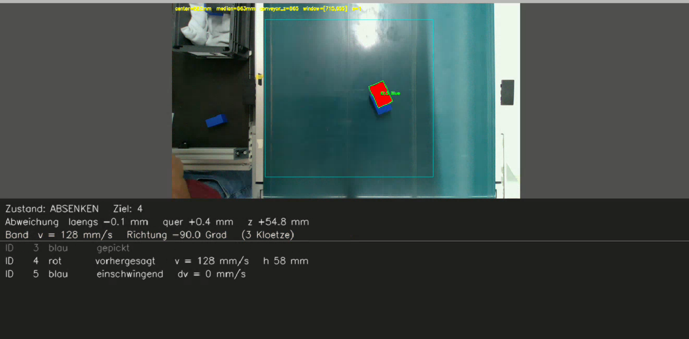
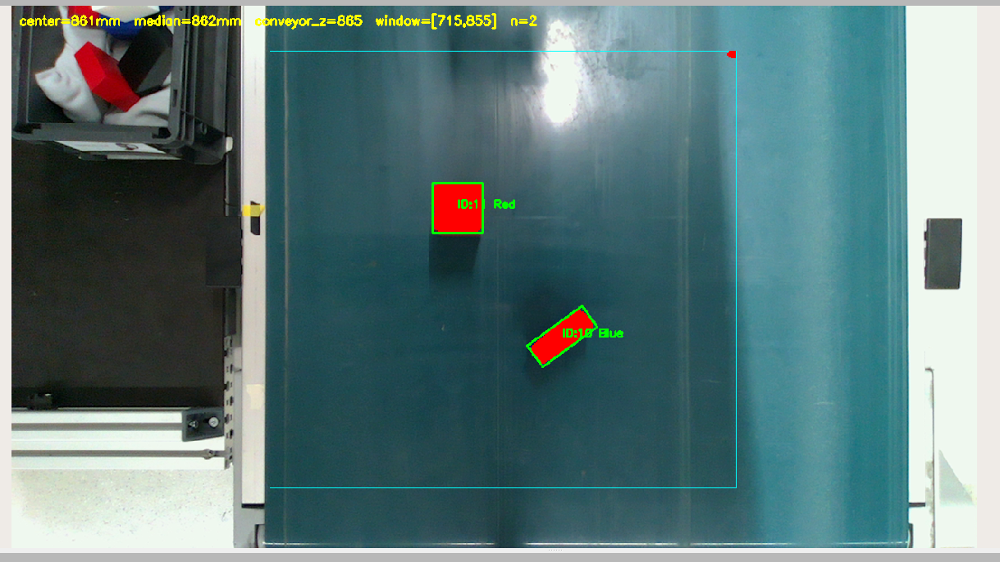
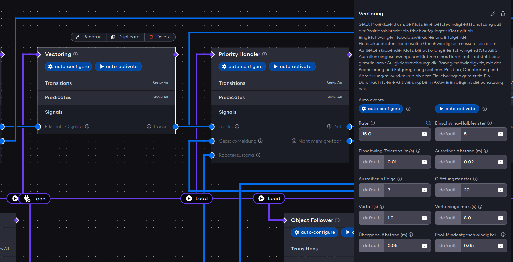

# 1 Einleitung

## 1.1 Ausgangslage und Motivation

Das Projekt erweitert ein bestehendes System zum Greifen und Sortieren von
Klötzen auf einem bewegten Förderband. Ein duales Kamerasystem ermittelt die
Positionen und Geschwindigkeiten der ankommenden Objekte. Das ursprüngliche
System berechnete daraus einen festen Abgriffpunkt. Der Roboter fuhr diese
Position an und wartete dort auf das Objekt.

Diese Prozessführung begrenzt die Zahl der Klötze, die der Roboter verarbeiten
kann. Besonders bei kurzen Abständen zwischen den Klötzen bleibt wenig Zeit
für die nächste Positionierung. Der Roboter soll deshalb nicht an einem festen
Punkt warten. Er soll sich mit dem ausgewählten Klotz mitbewegen und ihn aus
der Bewegung heraus greifen.

Damit wird die Handhabung flexibler. Das System soll mehrere gleiche oder
unterschiedliche Klötze gleichzeitig unterscheiden und nacheinander
bearbeiten. Es muss selbst entscheiden, welcher Klotz innerhalb des
verbleibenden Arbeitsbereichs noch sicher erreichbar ist. Nicht mehr
erreichbare Klötze bleiben auf dem Förderband. Die Positions- und
Geschwindigkeitsschätzung erfolgt dabei ausschließlich auf Basis der Bilddaten
[1].

Die Aufgabenstellung sieht außerdem den grundsätzlichen Funktionsnachweis bei
unterschiedlichen Bandgeschwindigkeiten vor. Daraus ergeben sich hohe
Anforderungen an die zeitliche Abstimmung von Erkennung, Zielauswahl und
Roboterbewegung. Der Bericht untersucht, wie diese Anforderungen im aktuellen
Versuchsaufbau umgesetzt und bewertet werden.

## 1.2 Zielsetzung des Projekts

Ziel des Projekts ist ein Konzeptnachweis für das kamerabasierte Greifen von
quaderförmigen Klötzen auf einem bewegten Förderband. Die Positions- und
Geschwindigkeitsschätzung soll ausschließlich aus Bilddaten entstehen. Ein
Encoder oder ein vergleichbares Signal des Förderbands ist dafür nicht
vorausgesetzt. Der Roboter soll die Klötze während ihrer Bewegung greifen
[1].

Neben dem Greifvorgang soll das System die Klötze nach Form und Farbe
kategorisieren. Die Kategorisierung dient der flexiblen Objektbeschreibung,
nicht einer Ablageaufgabe. Sie soll die Übertragbarkeit des Konzepts auf
weitere vergleichbare Anwendungsfälle ermöglichen. Befinden sich mehrere
Klötze gleichzeitig auf dem Förderband, soll das System selbstständig einen
noch erreichbaren Klotz auswählen. Klötze, die innerhalb des verbleibenden
Arbeitsbereichs nicht sicher erreichbar sind, werden nicht mehr als Ziel
verfolgt.

Der Funktionsnachweis steht im Mittelpunkt. Ein fertiges Industrieprodukt und
ein unter allen Bedingungen zuverlässig arbeitendes System sind nicht Ziel des
Projekts. Die Anlage wird dennoch bei unterschiedlichen Bandgeschwindigkeiten
getestet. Damit wird untersucht, wie sich die Bandgeschwindigkeit auf das
Greifen auswirkt.

Ein Förderband mit variabler Geschwindigkeit war für den Aufbau vorgesehen,
wurde jedoch innerhalb des Projektrahmens nicht in die Anlage integriert. Die
Bewertung erfolgt deshalb mit dem vorhandenen Förderband. Dieses ermöglicht
auch höhere Bandgeschwindigkeiten. Reflexionen und die daraus entstehenden
Störungen der Bildverarbeitung werden dabei als relevante Randbedingung der
Versuche betrachtet.

<!-- Merker für Kapitel 4 und 6: Die automatische Auswahl erreichbarer Klötze
ist im aktuellen Stand umgesetzt. Umsetzung und Funktionsnachweis mit eigenen
Messdaten beschreiben. -->

<!-- Merker für Kapitel 6 und 7: Mit dem schnelleren vorhandenen Förderband
sind die Projektziele trotz höherer Geschwindigkeit und Reflexionen erreichbar.
Die Aussage nur mit dokumentierten Versuchsbedingungen und Ergebnissen belegen. -->

## 1.3 Abgrenzung und Rahmenbedingungen

Die Projektarbeit ist auf einen Konzeptnachweis im vorhandenen Versuchsaufbau
begrenzt. Sie umfasst das Erkennen, Auswählen und Greifen quaderförmiger
Klötze auf dem bewegten Förderband. Zum Funktionsnachweis gehören das Anheben
eines erfolgreich gegriffenen Klotzes und seine sichere Ablage an einem
vorgegebenen Abgabeort.

Die Form- und Farbkategorisierung dient der Beschreibung der Klötze. Die
Auswahl eines Ziels erfolgt anhand von Position und Abmessungen. Eine
vollständige Sortier- oder Ablageanlage gehört nicht zum
Projektumfang. Ebenso wird kein fehlerfreies Greifen aller Klötze gefordert.
Das System darf Klötze verwerfen, wenn diese im verbleibenden Arbeitsbereich
nicht sicher erreichbar sind [1].

Die Versuche erfolgen bei ausgewählten Geschwindigkeiten des vorhandenen
Förderbands (Abschnitt 1.2). Die Ergebnisse gelten für den bestehenden Arbeitsraum sowie die vorhandenen
Lichtverhältnisse und Reflexionen. Das Projekt zielt nicht auf den Nachweis
einer vollständigen industriellen Anwendung.

<!-- Merker für 2.1.3: Die Roboterkamera gehört zum Systemaufbau. Sie darf als
optionales Korrektursignal verwendet werden, ist aber nicht Voraussetzung für
den erfolgreichen Greifablauf. Details zu ihrem derzeitigen Einsatz und ihren
Grenzen später beschreiben. -->

## 1.4 Aufbau des Berichts

Zunächst werden die technischen Voraussetzungen des Versuchsaufbaus erläutert.
Dazu gehören die eingesetzte Hardware, die Koordinatensysteme und der
Softwareaufbau. Darauf aufbauend beschreibt der Bericht das Konzept, mit dem
die Bilddaten in eine dynamische Greifbewegung überführt werden.

Anschließend folgt die Umsetzung der einzelnen Komponenten. Die Inbetriebnahme
zeigt, welche Parameter und Anpassungen für das Zusammenspiel von Kamera,
Regelung und Roboter erforderlich waren. Die Versuchsergebnisse bewerten den
Funktionsnachweis unter den definierten Bedingungen. Abschließend ordnet der
Bericht die erreichten Ergebnisse ein und leitet weitere technische Schritte
ab.

## 2 System und Versuchsaufbau

### 2.1 Hardwareaufbau

#### 2.1.1 Allgemeine Geometrie und Aufbau

Der Versuchsaufbau besteht aus einem Förderband, dem seitlich angeordneten
UR10e mit Greifer, einer Basiskamera und einer Ablagekiste. In Bandlaufrichtung
steht der Roboter auf der linken Seite nahe dem Bandende. Die Ablagekiste liegt
links neben dem Förderband und in Bandlaufrichtung vor dem Roboter. Ihre
Ablageposition beträgt im globalen Bezugssystem `world`
`x = -0,316 m`, `y = 0,476 m` und `z = 0,420 m`.

Als Basiskamera wird eine Intel RealSense L515 eingesetzt. Sie kombiniert eine
RGB-Kamera mit einem LiDAR-Tiefensensor. Die Tiefenmessung basiert auf einem
abtastenden Infrarotlaser. Damit stehen Farbinformationen zur Kategorisierung
und Tiefeninformationen zur räumlichen Einordnung der Klötze zur Verfügung
[2],
[3].
Die Kamera ist mittig über dem Bandanfang montiert. Ihr Abstand zur
Bandebene beträgt etwa `0,85 m`. Sie erfasst die Klötze vor dem Greifbereich.

Zusätzlich ist eine Intel RealSense D435i am Roboterflansch neben der Aufnahme
für den Greifer montiert. Ihre optische Achse ist gegenüber der Flanschmitte
parallel versetzt und erfasst den Bereich unmittelbar vor dem Greifer. Die
Kamera besitzt neben einem RGB-Sensor ein aktives Infrarot-Stereosystem zur
Tiefenmessung sowie eine integrierte inertiale Messeinheit. Sie kann die
Basiskamera bei der Feinortung ergänzen, ist für den nachgewiesenen Greifablauf
jedoch nicht erforderlich
[4],
[5].

Für die anfängliche Kalibrierung wurde das Bezugssystem `conveyor_frame`
definiert. Sein Ursprung liegt mittig am Bandanfang. Die X-Achse zeigt, in
Bandlaufrichtung betrachtet, nach rechts. Die Y-Achse zeigt in
Bandlaufrichtung, die Z-Achse von der Bandebene nach oben. Im Rahmen der
Anwendung werden ausschließlich die globalen Koordinaten des Bezugssystems
`world` verwendet. Dieses ist das von der UR10e-Steuerung verwendete System,
dessen Ursprung in der Roboterbasis liegt. Alle folgenden Koordinaten beziehen
sich auf dieses System. Die unterschiedlichen Koordinatenkonventionen von
`conveyor_frame` und `world` ergeben sich aus der zeitlichen Zusammenführung
der Teilprojekte.

Die nutzbare gerade Förderstrecke beträgt ungefähr `1,50 m` bei einer Breite
von etwa `0,80 m`. Das Förderband ist physisch etwas länger. Die gekrümmten
Bereiche über den Bandrollen stehen jedoch nicht als Greifbereich zur
Verfügung. Die Bandkanten liegen im globalen System ungefähr bei
`x = -1,275 m` und `x = -0,480 m`. Der für das Greifen nutzbare rechteckige
Bereich reicht von `x = -1,000 m` bis `-0,530 m` sowie von
`y = -0,320 m` bis `0,445 m`. Er wird in der Draufsicht als Arbeitsbereich
dargestellt. Der festgelegte Arbeitsraum des Flansches erweitert diesen
Bereich für die Ablage der Objekte auf `x = -1,000 m` bis `-0,300 m` und
`y = -0,320 m` bis `0,480 m`.

Die räumliche Anordnung des realen Aufbaus zeigen die Abbildungen 1 und 2.
Die Lage von Förderband, Kamera, Roboter, Ablagekiste und Arbeitsbereich wird
in Abbildung 3 schematisch verdeutlicht.

Die festgelegten zulässigen Höhen im Arbeitsbereich des Flansches betragen
`z = 0,299 m` und `z = 0,600 m`. An der unteren Grenze erreicht die
geschlossene Backenspitze die Oberfläche des Förderbandes. Die Bewegung, mit
der den fahrenden Objekten auf dem Förderband gefolgt wird, erfolgt auf
`z = 0,450 m`. Für den Transfer zur Ablage wird eine Freihöhe von
`z = 0,490 m` verwendet. Oberhalb von `z = 0,600 m` wurde im hinteren Bereich
des Arbeitsraums eine mögliche Singularität beobachtet. Zudem wird die Höhe
durch die über dem Förderband befindliche Basiskamera begrenzt.

Die zugehörigen Höhen und die Position der Basiskamera über dem Förderband sind
in Abbildung 4 dargestellt.

<!-- Word-Übernahme Skizzen: Abbildung 3 (`fig-systemaufbau-draufsicht`) und
Abbildung 4 (`fig-systemaufbau-seitenansicht`) nach den jeweiligen
Textverweisen einfügen.
Die Beschriftungen beruhen auf der Konfiguration vom 24.09.2026.
Bildunterschrift Abbildung 3: Draufsicht mit Förderband,
Basiskamera, Ablagekiste, Arbeitsbereich sowie den Bezugssystemen
`conveyor_frame` und `world`.
Bildunterschrift Abbildung 4: Seitenansicht mit
Basiskamera sowie Arbeitsraum-, Folge- und Transferhöhen im Bezugssystem
`world`. -->

<!-- Word-Übernahme Gesamtaufnahmen: Abbildung 1 (`fig-aufbau-gesamtansicht-1`)
und Abbildung 2 (`fig-aufbau-gesamtansicht-2`) unmittelbar nach dem
Textverweis einfügen.
Bildunterschrift Abbildung 1: Versuchsaufbau mit Förderband,
UR10e und Ablagekiste.
Bildunterschrift Abbildung 2: Arbeitsbereich des Roboters
über dem Förderband. -->

#### 2.1.2 UR10e

Die zentrale Handhabungseinheit des Aufbaus ist ein UR10e von Universal Robots.
Der Roboter besitzt sechs rotierende Gelenke. Seine Reichweite beträgt
`1.300 mm`, die maximale Nutzlast `12,5 kg`
[6].
Die Wiederholgenauigkeit ist mit `±0,05 mm` angegeben. Sie beschreibt die
Wiederholbarkeit des Roboterarms und nicht die absolute Genauigkeit des
gesamten kamerabasierten Greifprozesses. Der UR10e trägt den Greifer und
positioniert ihn über dem Förderband sowie am vorgegebenen Abgabeort.

Der UR10e ist für kollaborative Anwendungen ausgelegt. Seine
Sicherheitsfunktionen können unter anderem Grenzen für Geschwindigkeit, Kraft,
Impuls und Leistung überwachen. Wird eine konfigurierte Grenze überschritten
oder ein Sicherheitsfehler erkannt, wird die Roboterbewegung sicher
unterbrochen
[7].
Ob der Aufbau ohne trennende
Schutzeinrichtung betrieben werden darf, ergibt sich jedoch erst aus der
Risikobeurteilung des gesamten Systems. Dabei müssen insbesondere Greifer,
Klötze, Bewegungen und Quetschstellen berücksichtigt werden. Der Endeffektor
ist nicht automatisch durch die Sicherheitsfunktionen des Roboterarms
abgedeckt
[8].

#### 2.1.3 Robotiq-2F-140-Greifer

Am Flansch des UR10e ist ein adaptiver Zweifingergreifer vom Typ
Robotiq 2F-140 montiert. Die Herstellerabmessungen des geöffneten Greifers
zeigt Abbildung 5
[9].

<!-- Word-Übernahme: `fig-greifer-robotiq-2f140-abmessungen` an dieser Stelle
einfügen.
Bildunterschrift: Herstellerabmessungen des geöffneten
Robotiq-2F-140-Greifers (Quelle: [9]). -->

*Abbildung 5: Herstellerabmessungen des
geöffneten Robotiq-2F-140-Greifers (Quelle:
[9]).*

Jeder Finger besteht aus zwei starren Abschnitten. Diese Abschnitte werden
Phalangen genannt und sind über ein Gelenk verbunden. Ein einziger Antrieb
bewegt beide Finger. Der Greifer besitzt damit weniger Antriebe als Gelenke.
Beim Schließen drehen sich die Phalangen um ihre Gelenke. Die Greifflächen
folgen deshalb einer gekrümmten Bahn und nicht einer geraden parallelen
Bewegung. Abhängig von Geometrie und Lage des Klotzes entsteht ein paralleler
oder umschließender Griff
[10].

Ein Klotz kann deshalb an seinen Seiten nicht beliebig tief gegriffen werden.
Bei einem zu tiefen seitlichen Eingriff würden die Phalangen beim Schließen mit
der Oberseite des Klotzes kollidieren. Die Greiftiefe ist somit durch die
Fingergeometrie begrenzt. Außerdem verändert sich die räumliche Höhe des
Greifers zwischen offenem und geschlossenem Zustand. Der zulässige Arbeitsraum
und die Greifhöhe müssen diese Zustandsänderung berücksichtigen.

Schließgeschwindigkeit und Schließkraft sind einstellbar. Der Kraftwert
begrenzt den maximalen Motorstrom und damit die beim Schließen verfügbare
Greifkraft. Treffen die Finger auf einen Widerstand und wird diese Grenze
erreicht, hält der Greifer an. Sein Gerätestatus meldet den Kontakt als
erkannte Objektaufnahme. Bei geeigneter Kraftkonfiguration kann die integrierte
Nachgreiffunktion einen späteren Objektverlust erkennen und die Finger weiter
schließen
[10].

Die tatsächlich nutzbare Öffnungsweite wurde am aufgebauten System mit
`127 mm` gemessen. An den Fingerendgliedern sind 3D-gedruckte Aufsätze mit
Gummi-Grippmatten montiert. Die Greiffläche jeder Matte beträgt
`20 mm × 15 mm`.

Vor dem Betrieb wird der Öffnungsbereich des Greifers kalibriert. Dadurch ist
die Öffnungsweite im aufgebauten System als Millimeterwert verfügbar. Der
Greifer ist über USB mit dem Rechner verbunden. Er wird damit extern
angesteuert und nicht über die direkte Roboteransteuerung bedient.

#### 2.1.4 Förderband und Klötze

Das Förderband führt die Klötze vom manuellen Auflagepunkt am Bandanfang durch
den Erfassungsbereich der Basiskamera zur Greifzone. Die Geschwindigkeit bleibt
während eines Versuchs konstant. Vor Versuchsbeginn können verschiedene
Geschwindigkeitsstufen eingestellt werden. Eine Stoppuhrmessung der niedrigsten
Einstellung, Stufe 1, ergab Werte zwischen `125 mm/s` und `133 mm/s`
[11].
Die gemessene Geschwindigkeit dient später als Gegenprobe für die aus den
Bilddaten geschätzte Bandgeschwindigkeit.

Für die Versuche wurden ausschließlich quaderförmige, 3D-gedruckte Klötze
verwendet. Der am häufigsten verwendete flache Klotz besitzt die Abmessungen
`25 mm × 50 mm × 75 mm`. Daneben kamen ein großer Quader mit
`100 mm × 50 mm × 50 mm` sowie Würfel mit einer Kantenlänge von `50 mm` zum
Einsatz. Die Klötze sind rot, blau, weiß oder schwarz. Ihre Oberseiten sind
überwiegend matt, während einzelne Seitenflächen stärker reflektieren
[11].

Die Klötze können stehend, liegend, flach oder gedreht auf dem Band liegen.
Runde Klötze wurden bewusst ausgeschlossen. Ihre Orientierung lässt sich mit
dem gewählten Ansatz nicht eindeutig erfassen und ist für den vorgesehenen
Greifablauf nicht erforderlich. Die verwendeten Geometrien begrenzen den
Funktionsnachweis damit auf quaderförmige Objekte.

#### 2.1.5 Basiskamera

Die Basiskamera ist die zentrale Sensorik des finalen Greifablaufs. Die
L515 liefert ein RGB-Bild mit `1.280 × 720 Pixel` bei `15 Hz` und
ein Tiefenbild mit `640 × 480 Pixel` bei `30 Hz`. Die unterschiedliche Rate
ergibt sich aus dem verwendeten Tiefenprofil der L515
[12].

Der sichtbare Bandbereich reicht im Bezugssystem `world` ungefähr von
`y = +1,03 m` bis `y = +0,46 m`. Die Greifzone beginnt unmittelbar hinter
diesem Bildbereich. Der Roboter und sein Greifer verdecken die Kamera damit
während des Greifvorgangs nicht. Die weitere Führung eines erkannten Klotzes
bis zur Greifzone wird erst im Kapitel zum Greifkonzept beschrieben.

Das Gestell der Kamera ist nicht ausreichend steif, um ihre Lage nach Änderungen am Aufbau dauerhaft
als unveränderlich anzunehmen. Bereits kleine Lageänderungen beeinflussen die
Umrechnung der Kameramessung in das Bezugssystem `world`. Deshalb ist ein
einfach ausführbares und wiederholbares Kalibrierverfahren für den Aufbau
erforderlich. Das Kalibrierverfahren selbst wird in Kapitel 4 erläutert
[12].

#### 2.1.6 Roboterkamera

Die in Abschnitt 2.1.1 beschriebene Roboterkamera bewegt sich gemeinsam mit
dem Flansch. Im finalen Greifablauf ist sie nicht in den aktiven Regelpfad
eingebunden. Die Gründe für diese Entscheidung erläutert Abschnitt 3.1. Die
für einen späteren Einsatz vorbereitete Kalibrierung der Roboterkamera
beschreibt Abschnitt 4.3
[13].

### 2.2 Koordinatensysteme und Greifgeometrie

#### 2.2.1 Bezugssystem `world`, Roboterbasis und Flansch `ur_tool0`

Alle Positionsangaben des Regelpfads beziehen sich auf das globale
Bezugssystem `world` (Abschnitt 2.1.1). Das System ist fest mit dem Roboter
verbunden und bewegt sich nicht mit dem Förderband. Die Förderbewegung erfolgt
im Aufbau näherungsweise in negative Y-Richtung von `world`. Das Förderband
liegt gemäß Abbildung 3 seitlich der Roboterbasis
im Bereich negativer X-Koordinaten. Die Z-Achse zeigt nach oben. Die Bandoberfläche liegt bei `z = 0,054 m`
[14].

Das Bezugssystem `conveyor_frame` aus Abschnitt 2.1.1 wird im finalen Betrieb
nicht verwendet. Dadurch entfällt im Regelpfad eine zusätzliche Umrechnung
zwischen Band und Roboter.

Die Robotersteuerung liefert als geregelte Pose die Lage des Flansches
`ur_tool0`. Sie ist von einem in der UR-Steuerung konfigurierten TCP zu
unterscheiden. Die daraus folgende Lage des tatsächlichen Griffpunkts wird im
nächsten Abschnitt bestimmt. Die räumliche Zuordnung von Roboterbasis, Flansch
`ur_tool0` und Griffpunkt zeigt Abbildung 6.

<!-- Word-Übernahme: `fig-koord-systeme` nach dem vorstehenden Textverweis
einfügen. Die Abbildung muss Roboterbasis, `world-Y−`, `world-Z+`, Flansch
`ur_tool0` und Griffpunkt eindeutig unterscheiden.
Bildunterschrift: Seitenansicht des Roboters mit Bezugssystem `world`, Flansch
`ur_tool0` und Griffpunkt. -->

*Abbildung 6: Seitenansicht des Roboters mit Bezugssystem `world`, Flansch `ur_tool0` und Griffpunkt.*

#### 2.2.2 TCP, Flansch und Griffpunkt

Der Greifer ist in der regulären Greifpose senkrecht nach unten ausgerichtet.
Der Klotz wird mittig zwischen den Backen auf Höhe der Auflageflächen gegriffen.
Für die Kalibrierung ist die Flanschposition bei geschlossenem Greifer
maßgebend.

Vom Flansch bis zur geschlossenen Backenspitze wurden `0,245 m` gemessen. Dieser
Abstand dient zur Bestimmung der Bandhöhe und zur Beurteilung des Abstandes zum
Förderband. Die Auflageflächen der Backen sind `20 mm` hoch. Der für die
Greifbewegung verwendete Griffpunkt liegt in ihrer Mitte. Sein Abstand zum
Flansch beträgt damit `0,235 m` [15].

Die erkannte Klotzposition beschreibt den Griffpunkt, nicht die Flanschpose.
Der `object_follower` addiert daher den festen Versatz von `0,235 m` in
Z-Richtung auf die berechnete Greifposition. Da der Greifer senkrecht bleibt und
der Griffpunkt auf der Flanschachse liegt, ist keine weitere räumliche
Transformation erforderlich. Die sich beim Öffnen und Schließen verändernde
Greifergeometrie wird im folgenden Abschnitt beim Arbeitsraum betrachtet.

#### 2.2.3 Arbeitsraum und Greifzone

Die in Abschnitt 2.1.1 genannten Arbeitsraumgrenzen bilden den zulässigen Raum
für Flanschzielposen im Bezugssystem `world`. Sie begrenzen damit auch den
Raum, in dem die Greifzone liegen darf. Der Flansch wurde hierfür am Aufbau per
Handführung über den Bandbereich bewegt. Die Grenzen wurden so gewählt, dass
keine Kollision und keine auffällige Singularität auftrat.

Die Warte- und Beobachtungsposition des Flansches liegt bei
`x = -0,816 m`, `y = 0,350 m` und `z = 0,450 m`. Die Backen sind dort mit einer
Gier von `90°` quer zur Bandrichtung ausgerichtet. Die Position befindet sich
am Beginn der Greifzone über der Bandmitte. Ohne ausgewähltes Ziel wartet der
Roboter dort und beobachtet die einfahrenden Klötze.

Die Greifzone entspricht dem in Abschnitt 2.1.1 genannten, für das Greifen
nutzbaren Bereich und ist eine engere Teilmenge des Arbeitsraums. Die
Erweiterung des Arbeitsraums in positive
Y-Richtung und zu größeren X-Werten dient ausschließlich der Ablagebox. Sie
wird bei der Zielauswahl auf dem Förderband nicht verwendet. Die räumliche
Anordnung von Förderband, Roboter und Ablagebox zeigt Abbildung 3
[16].

Die gekrümmte Bewegung der Greiferphalangen verändert beim Öffnen und Schließen
den räumlichen Bauraum des Greifers. Die Arbeitsraumgrenzen müssen daher für
beide Greiferzustände betrachtet werden. Für diese Abgrenzung wird kein
zusätzlicher Höhenwert verwendet.

### 2.3 Softwareumgebung

#### 2.3.1 AICA und ROS 2

Die Projektanwendung basiert auf dem AICA System. AICA Core stellt einen
vorkonfigurierten Robotik-Workspace mit Komponenten, Controllern und
Hardware-Interfaces bereit. AICA Studio dient als grafische Umgebung, um diese
Bausteine zu einer Anwendung zu verbinden, zu konfigurieren und zu überwachen.
Das System baut auf ROS 2 auf. ROS 2 übernimmt dabei die Kommunikation zwischen
den Prozessen sowie die Anbindung von Kameras und Roboterhardware
[17].

Die verwendete Anwendung basiert auf dem AICA-Systemabbild `v2.0.5-jazzy` mit
AICA Core `v5.0.0`. AICA-Komponenten werden periodisch ausgeführt. Ihre
Arbeitsrate, Parameter, Eingangssignale und Ausgänge sind innerhalb der
Anwendung festgelegt
[18], [19].

#### 2.3.2 Komponentenstruktur

Die Projektspezifik ist in eigenen Python-Komponenten umgesetzt. Sie kapseln
Erkennung, Bahnverfolgung, Zielauswahl, Greifablauf und Diagnose. Die zugehörige
Fachlogik ist von den ROS-Schnittstellen getrennt. Dadurch können die
Berechnungen unabhängig von der Laufzeitumgebung geprüft werden. Alle eigenen
Python-Komponenten laufen gemeinsam in einem Prozess. Ihre Callbacks dürfen
deshalb die periodische Verarbeitung nicht blockieren
[19].

AICA ergänzt diese Komponenten um die Hardwareanbindung und die
Bewegungsumsetzung. Dazu gehören die Schnittstelle zum UR10e, der
Inverse-Kinematik-Controller und der Signal Point Attractor. Die konkrete
Aufgabenverteilung der Komponenten und Controller wird in Kapitel 3 beschrieben.

#### 2.3.3 Signal- und Datenfluss

Die Komponenten tauschen ihre Daten über AICA-Signale aus. Diese bilden eine
periodische Abstraktion für die Datenübertragung und können mit ROS-2-Topics
verbunden werden. Im Projekt sind Aufbau und Bedeutung der Datenfelder zentral
in Datenverträgen festgelegt. Dazu gehören Einheiten, Feldreihenfolge und
Zeitstempel. Dadurch verwenden Sender und Empfänger dieselbe Bedeutung eines
Signals
[20], [19].

Der Datenfluss verbindet die Bildverarbeitung, die Berechnung der Objektbahn,
die Zielauswahl und die Bewegungsregelung. Die vollständige Kette sowie die
einzelnen Signale werden im folgenden Kapitel erläutert.

## 3 Greifkonzept und Umsetzung

### 3.1 Funktionskette des Pick-on-the-Fly

Der Prozess beginnt bei der Basiskamera. Da die Greifzone hinter ihrem
Bildbereich liegt (Abschnitt 2.1.5), greift der Roboter einen Klotz an einer
Stelle, an der er nicht mehr gemessen wird. Das Konzept beruht darauf, Lage und
Geschwindigkeit im Kamerabild so genau zu bestimmen, dass die weitere Bewegung
des Klotzes vorhergesagt werden kann.

Daraus ergibt sich eine Kette von fünf Schritten. `base_cam` erkennt und
vermisst die Klötze im Kamerabild. `vectoring` schätzt ihre Geschwindigkeit und
berechnet ihre Position über das Kamerabild hinaus weiter. Der `priority_handler` ermittelt
den nächsten erreichbaren Klotz. Der `object_follower` führt den Greifer über
den Klotz, greift ihn mitfahrend und legt ihn in der Ablagekiste ab.
Die Komponente `robotiq_gripper` steuert den Greifer. Das Ergebnis jedes
Greifversuchs geht an den `priority_handler` zurück, der daraufhin das nächste
Ziel wählt.

Die Komponenten tauschen ihre Daten über die in Tabelle 1 zusammengefassten Signale aus. Positionen und
Geschwindigkeiten stehen in SI-Einheiten und im Bezugssystem `world`. Die
Objektdaten von `base_cam` bis `priority_handler` tragen den Zeitstempel des
zugrunde liegenden Kamerabilds.

*Tabelle 1: Signale des Regelpfads.*

| Signal | Sender → Empfänger | Inhalt |
|---|---|---|
| `objects` | `base_cam` → `vectoring` | je Klotz Kennung, Farbe, Position, Abmessungen und Drehwinkel aus dem aktuellen Bild |
| `tracks` | `vectoring` → `priority_handler` | Bandgeschwindigkeit nach Betrag und Richtung; je Klotz Status (einschwingend, eingeschwungen, vorhergesagt) sowie geglättete Lage und Abmessungen |
| `target` | `priority_handler` → `object_follower` | gewählter Klotz mit Lage und Abmessungen, Bandgeschwindigkeit, Beginn der Greifzone und Greifebene |
| `target_pose` | `object_follower` → Signal Point Attractor | Zielpose des Flansches |
| `twist` | Signal Point Attractor → IK Velocity Controller | kartesische Sollgeschwindigkeit des Flansches |
| `cartesian_state` | Roboter → Attractor, `object_follower`, `priority_handler` | aktuelle Pose des Flansches `ur_tool0` |
| `gripper_close` | `object_follower` → `robotiq_gripper` | Befehl Greifer schließen oder öffnen |
| `motion_done`, `has_object` | `robotiq_gripper` → `object_follower` | Bewegung beendet, Klotz gehalten |
| `picked_id` | `object_follower` → `priority_handler` | Kennung des Klotzes und Ergebnis des Greifversuchs |

Weitere Signale versorgen ausschließlich die Anzeige des Systemzustands. Sie
wirken nicht auf den Regelpfad zurück.

Für Bahnführung und Regelung des Roboters werden vorhandene AICA-Bausteine genutzt.

Die Komponenten arbeiten mit unterschiedlichen Raten. Bildverarbeitung und
Schätzung laufen mit 15 Hz, der Bildrate der Kamera. Die Zielauswahl arbeitet
mit 20 Hz, die Bahnführung mit 50 Hz. Die Regelung des Roboters läuft mit
500 Hz. Die Raten sind entsprechend der genutzten Hardware gewählt
[21].

Dass die Roboterkamera für den Greifablauf nicht eingebunden ist (Abschnitt
2.1.6), hat drei Gründe. Die Basiskamera allein erreicht eine Längsabweichung von rund 1 mm und reicht damit für den
Greifablauf aus. Die Erkennung der Roboterkamera war dagegen nicht ausreichend
zuverlässig. Reflexionen auf Band und Klotzseiten sowie flache Klötze, die sich
im Tiefenbild kaum vom Band abheben, führten zu Abweichungen von mehreren
Zentimetern. Zusätzlich hätte ihre Auswertung die Rechenlast des gemeinsamen
Prozesses der Komponenten erhöht
[21].

### 3.2 Erkennung, Vermessung und Vorhersage

#### 3.2.1 `base_cam` und Objektdaten

`base_cam` wertet Farb- und Tiefenbild der Basiskamera aus. Im Tiefenbild gilt
alles als Objekt, was innerhalb eines festgelegten Bildausschnitts eine
Mindesthöhe über der Bandoberfläche überschreitet. Aus dem Umriss jedes Objekts
wird das
kleinste umschließende Rechteck bestimmt. Es liefert Mittelpunkt, Länge, Breite
und Drehwinkel des Klotzes. Die Tiefe der Oberseite ergibt sich als Median über
den Umriss. Randpixel, die bereits das Band messen, verfälschen die Höhe
dadurch nicht. Die Farbe wird im Farbbild über den Farbton bestimmt.

Mit der Kalibrierung (Kapitel 4) rechnet `base_cam` alle Werte in das
Bezugssystem `world` um. Die Messungen aufeinanderfolgender Bilder werden
einander zugeordnet, und jeder Klotz erhält eine feste Kennung. Farbe und
Abmessungen werden je Klotz erfasst, die Zielauswahl nutzt davon nur die
Abmessungen (Abschnitt 1.3).

Die Position eines Klotzes streut von Bild zu Bild nur um Bruchteile eines
Millimeters. Die gemessene Grundfläche schwankt dagegen deutlich. Geometrische
Prüfungen erfolgen deshalb erst auf den geglätteten Werten aus `vectoring`.

#### 3.2.2 `vectoring` und Geschwindigkeits- und Positionsschätzung

Die Bandgeschwindigkeit wird aus den Bilddaten geschätzt. `vectoring` verfolgt
dazu für jeden Klotz den Verlauf seiner Position über der Zeit.

Ein aufgelegter Klotz kann beim Aufsetzen kippen oder noch schwanken. Seine ersten
Messungen sind für eine Geschwindigkeitsschätzung deshalb ungeeignet.
`vectoring` teilt die jüngsten Messungen in zwei aufeinanderfolgende Fenster
von je fünf Messungen und bestimmt in jedem die Geschwindigkeit. Stimmen beide
auf 0,01 m/s überein, gilt der Klotz als eingeschwungen. Ein Kippen erzeugt
einen Sprung in der Position, der zunächst in einem der Fenster liegt. Der
Klotz gilt so erst als eingeschwungen, wenn der Sprung beide Fenster verlassen
hat. Nur eingeschwungene Klötze können als Ziel gewählt werden. Einzelne
Messungen, die weit von der erwarteten Position abweichen, werden als Ausreißer
verworfen.

Alle Klötze liegen frei auf dem Band und bewegen sich mit derselben
Geschwindigkeit. `vectoring` fasst deshalb die Messungen aller eingeschwungenen
Klötze eines Durchlaufs in einer gemeinsamen Ausgleichsrechnung zusammen. Sie
liefert die Bandgeschwindigkeit nach Betrag und Richtung. Lange, ungestörte
Messreihen gehen dabei stärker ein als kurze. Mit jedem weiteren Klotz wird die
Schätzung genauer.

Ab dem Einschwingen mittelt `vectoring` Position, Abmessungen und Drehwinkel
über die letzten 20 Messungen. Verlässt ein eingeschwungener Klotz das
Kamerabild, wird er mit der geschätzten Bandgeschwindigkeit weitergeführt.
Seine Position wird dann vorhergesagt statt gemessen. Auf dieser Grundlage
greift der Roboter Klötze in der Greifzone hinter dem Kamerabild, ohne ihre
Position dort aktuell zu messen
[21].

### 3.3 Zielauswahl und Erreichbarkeitsprüfung

#### 3.3.1 `priority_handler` und Greifebene

Der `priority_handler` ermittelt, welcher Klotz als nächster gegriffen wird.
Grundlage sind die Greifzone und die Greifebene. Die Greifzone ist der Bereich
des Bandes, in dem der Roboter greifen darf. Sie ist in Abschnitt 2.2.3
festgelegt. Die Greifebene ist die letzte Position entlang des
Bandes, an der das Absenken beginnen darf. Von dort aus muss der Greifprozess
vor dem Ende der Greifzone abgeschlossen sein. Ihre Lage ergibt sich aus der
Dauer dieses Prozesses, der Bandgeschwindigkeit und einem Zuschlag von 20 %. Bei höherer Bandgeschwindigkeit rückt die Greifebene
daher weiter an den Anfang der Greifzone.

#### 3.3.2 Greifbarkeits- und Erreichbarkeitsprüfung

Ein Klotz kommt als Ziel in Frage, wenn er drei Bedingungen erfüllt. Er muss
eingeschwungen sein und seine Spur muss in die Greifzone führen. Er muss
greifbar sein: Seine Höhe beträgt mindestens 20 mm, und seine Diagonale passt
mit 10 mm Reserve in die Greiferöffnung von 127 mm. Die Diagonale deckt dabei
jede Greifrichtung ab. Außerdem muss er rechtzeitig erreichbar sein. Die Zeit,
bis der Klotz die Greifebene erreicht, muss länger sein als die Zeit, die der
Roboter bis zur Freigabe des Absenkens benötigt. Diese setzt sich aus dem
waagerechten Anfahrweg bei Höchstgeschwindigkeit und dem Einschwingen der
Bewegung zusammen.

Unter allen Kandidaten wählt der `priority_handler` den dringendsten noch
greifbaren Klotz. Das ist der Klotz mit der kürzesten verbleibenden Zeit bis zur Greifebene. Die Wahl
bleibt bestehen, bis der `object_follower` ein Ergebnis meldet. Ein
Zielwechsel während der Bewegung ist damit ausgeschlossen. Nicht greifbare
oder nicht erreichbare Klötze bleiben auf dem Band
[21].

### 3.4 Bahnführung und Greifablauf

#### 3.4.1 `object_follower` und Zustandsautomat

Der `object_follower` setzt den Greifablauf als Zustandsautomaten um. In jedem
Zustand gibt er eine Zielpose des Flansches aus, der Greifer zeigt dabei stets
senkrecht nach unten. Abbildung 7 zeigt die
Zustände und ihre Übergänge.

<!-- Word-Übernahme: `fig-follower-zustandsdiagramm` an dieser Stelle
einfügen.
Bildunterschrift: Zustandsautomat des `object_follower`. Die gestrichelte
Umrandung fasst die Zustände zusammen, aus denen ein Versuch abgebrochen werden
kann, bevor der Greifer den Klotz hält. -->

*Abbildung 7: Zustandsautomat des
`object_follower`. Die gestrichelte Umrandung fasst die Zustände zusammen, aus
denen ein Versuch abgebrochen werden kann, bevor der Greifer den Klotz hält.*

Der `object_follower` startet im Zustand `ABBRUCH` und fährt senkrecht auf die
Freihöhe. Dadurch ist der Start aus jeder Roboterstellung sicher. Anschließend
wartet er in der Beobachtungspose aus Abschnitt 2.2.3 (`WARTEN`). Ein vollständiger
Greifversuch durchläuft die Zustände von `ANFAHREN` bis `LOESEN` und endet
wieder in `WARTEN`.

#### 3.4.2 Anfahren und Folgen

Mit einem gewählten Ziel fährt der Flansch auf der Folgehöhe über den Klotz
(`ANFAHREN`). Die Zielpose ist die vorhergesagte Position des Klotzes,
ergänzt um einen Vorhalt in Bandrichtung (Abschnitt 3.5.1). Liegt der Klotz
noch vor der Greifzone, wartet der Flansch am Zonenrand auf der Spur des
Klotzes in Bandrichtung. Sobald der Klotz die Greifzone erreicht, folgt der
Flansch ihm (`FOLGEN`). Dabei dreht sich der Greifer in den Winkel des Klotzes.
Ein Quader kann über beide Seitenpaare gegriffen werden. Eine Drehung um
höchstens ±45° genügt deshalb für jede Lage und stellt sicher, dass der
vorhandene Kameraaufbau nicht beschädigt wird.

Das Absenken wird freigegeben, wenn die Abweichung zwischen Flansch und Ziel
über zehn Takte innerhalb enger Toleranzen bleibt. Zusätzlich darf der
Klotz die Greifebene noch nicht erreicht haben.

#### 3.4.3 Absenken, Greifen, Heben und Ablage

Beim Absenken fährt der Flansch auf die Greifhöhe und folgt dem Klotz dabei
weiter (`ABSENKEN`). Der Winkel bleibt ab diesem Zeitpunkt unverändert. Die
Greifhöhe fasst den Klotz auf halber Höhe, mindestens aber 11 mm
(geschlossene Greiferhöhe) über dem Band. So werden auch flache Klötze sicher
gegriffen, ohne dass das Risiko einer Kollision von Greifer und Band besteht.

Im Zustand `GREIFEN` schließt der Greifer, während der Flansch weiter
mitfährt. Meldet der Greifer einen gehaltenen Klotz, hebt der Flansch ihn an
und fährt dabei mit der Bandgeschwindigkeit weiter, bis der Klotz die
Bandoberfläche verlassen hat (`HEBEN`). Anschließend steigt er senkrecht auf
die Freihöhe und fährt erst danach zur Ablagekiste, über der der Greifer
öffnet (`ABLEGEN`, `LOESEN`).
Danach kehrt der `object_follower` in die Beobachtungspose zurück und meldet
das Ergebnis an den `priority_handler`.

#### 3.4.4 Fehlerbehandlung und Abbruch

Bis der Greifer den Klotz hält, beendet jede Unstimmigkeit den Versuch. Dazu
gehören ein Überschreiten der Greifebene vor dem Absenken, ein entzogenes oder
veraltetes Ziel, eine Zeitüberschreitung und ein Fehlgriff. Der Flansch fährt
dann senkrecht auf die Freihöhe und kehrt in die Beobachtungspose zurück. Der
Klotz bleibt auf dem Band. Hält der Greifer bereits einen Klotz, wird dieser
auch bei einem Abbruch in der Kiste abgelegt. So fällt kein Klotz
unkontrolliert aus dem Greifer.

Unabhängig vom Zustand durchläuft jede Zielpose vor der Ausgabe eine
Sicherheitsprüfung. Ungültige Werte und Sprünge zwischen zwei Takten werden
verworfen. Jede Pose wird auf den Arbeitsraum begrenzt. Ist die
zuletzt gemeldete Roboterpose älter als 0,2 s, gibt der `object_follower`
keine neue Zielpose aus
[21].

### 3.5 Bewegungsumsetzung in AICA

#### 3.5.1 Signal Point Attractor und Vorhalt

Der `object_follower` gibt keine Geschwindigkeit, sondern eine Zielpose aus.
Die Umsetzung in eine Bewegung übernimmt der AICA-Baustein Signal Point
Attractor. Er erzeugt eine kartesische Geschwindigkeit, die proportional zur
Abweichung zwischen aktueller Flanschpose und Zielpose ist. Die Verstärkung
beträgt K = 5 1/s, die Geschwindigkeit ist auf 0,85 m/s begrenzt.

Ein Proportionalregler folgt einem gleichförmig bewegten Ziel mit einem
bleibenden Nachlauf. Bei der Bandgeschwindigkeit v beträgt er v/K. Ohne
Ausgleich würde der Greifer deshalb stets hinter dem Klotz zufassen. Der
`object_follower` setzt das Ziel aus diesem Grund um einen Vorhalt in
Bandrichtung voraus. Der Vorhalt ist als Zeit festgelegt und wird mit der
geschätzten Bandgeschwindigkeit multipliziert. Er beträgt 0,24 s, also etwa
1/K, und gilt damit für jede Bandgeschwindigkeit. Am Aufbau folgt der Flansch
dem Klotz so mit einer Längsabweichung von rund 1 mm und damit ausreichend
genau für einen sicheren Greifprozess
[21].

#### 3.5.2 IK Velocity Controller und Geschwindigkeitsgrenzen

Der IK Velocity Controller rechnet die kartesische Geschwindigkeit über die
inverse Kinematik in Gelenkgeschwindigkeiten um. Die Hardwareschnittstelle des
UR10e setzt sie mit 500 Hz um. Der Controller begrenzt die lineare
Geschwindigkeit ebenfalls auf 0,85 m/s und zusätzlich die Änderungsrate der
Befehle. Geregelt wird der Flansch, da der Greifer nicht im Robotermodell
enthalten ist. Den Versatz zum Griffpunkt berücksichtigt der
`object_follower` (Abschnitt 2.2.2)
[21].

### 3.6 Greiferansteuerung und Rückmeldungen

Der Robotiq 2F-140 wird über die eigene Komponente `robotiq_gripper`
angesteuert. Sie kommuniziert über USB mit dem Protokoll Modbus RTU. Der
`object_follower` gibt nur einen Schaltbefehl aus: Greifer schließen oder
öffnen. Die Komponente meldet zwei Zustände zurück. „Bewegung beendet“ zeigt
an, dass der Greifer seine Endlage erreicht hat. „Klotz gehalten“ zeigt an,
dass die Finger beim Schließen auf Widerstand getroffen sind.

Aus beiden Meldungen entscheidet der `object_follower`, ob ein Griff gelungen
ist. Schließt der Greifer vollständig ohne Widerstand, liegt ein Fehlgriff vor.
Entfällt die Meldung „Klotz gehalten“ auf dem Weg zur Kiste, gilt der Klotz
als verloren
[21].

### 3.7 Interface Streamer und Laufzeitdiagnose

Der `interface_streamer` stellt den aktuellen Zustand der Anwendung für die
Inbetriebnahme und Fehlersuche dar. Er empfängt das Debug-Bild von `base_cam`,
den Weltzustand aus `data_tracker` und den Status des `object_follower`. Die
Anzeige wird mit 10 Hz aktualisiert und hat keine Rückwirkung auf den
Regelpfad
[22].

Abbildung 8 zeigt die Anzeige während eines
Greifvorgangs. Neben dem Kamerabild sind Follower-Zustand, gewählte Ziel-ID,
Regelabweichungen, geschätzte Bandgeschwindigkeit sowie die bekannten Objekte
und ihre Bearbeitungszustände sichtbar. Dadurch lässt sich prüfen, ob ein Klotz
gewählt, gegriffen oder noch eingeschwungen ist.

<!-- Word-Übernahme: `fig-interface-streamer-betrieb` an dieser Stelle einfügen. -->

*Abbildung 8: Interface Streamer im Betrieb mit
Debug-Bild der Basiskamera, Follower-Zustand, Ziel, Regelabweichungen und
Trackübersicht.*

Das Debug-Bild der Basiskamera verdeutlicht Abbildung 9. Es markiert den für die Detektion verwendeten
Bildbereich (ROI) sowie die erkannten Klötze mit den IDs 10 und 11 und ihren
Farben.

<!-- Word-Übernahme: `fig-basecam-erkennung-roi` an dieser Stelle einfügen. -->

*Abbildung 9: Debug-Bild der Basiskamera mit den
erkannten Objekten ID 10 und ID 11, deren Farben und dem für die Detektion
verwendeten Bildausschnitt (ROI).*

## 4 Kalibrierung

### 4.1 Kalibrierungsstrategie und Bezugssysteme

<!-- Hier vlt Unterschied Hand-to-eye in Kap. 4.2 und eye-in-hand in Kap. 4.3 klarstellen -->

Alle Komponenten des Regelpfads rechnen im Bezugssystem `world`, dessen
Ursprung in der Roboterbasis liegt. Die Messungen der Basiskamera werden
entsprechend in dieses System überführt. Dafür werden die Eigenschaften der
Kamera und ihre Lage relativ zum Roboter benötigt. Tabelle 2 ordnet diese Größen ihrer Herkunft zu.

*Tabelle 2: Geometrische Größen des Regelpfads und
ihre Herkunft.*

| Größe | Herkunft | Abschnitt |
|---|---|---|
| Intrinsische Parameter der Basiskamera | Werkskalibrierung, vom Kameratreiber bereitgestellt | 4.1 |
| Lage der Basiskamera in `world` | Kalibrierung | 4.2 |
| Abstand zwischen Flansch und Griffpunkt | Messung am Aufbau, 0,235 m | 2.2.2 |
| Bandrichtung und Bandgeschwindigkeit | Schätzung zur Laufzeit aus den Bilddaten | 3.2.2 |

Die intrinsischen Parameter werden durch den Hersteller kalibriert und stehen
über den Kameratreiber zur Verfügung. Bandrichtung und Bandgeschwindigkeit
werden bewusst nicht kalibriert. Das System schätzt sie aus den Bilddaten und
bleibt so auch bei einer veränderten Bandgeschwindigkeit verwendbar. Dafür
genügt ein Neustart, der die errechnete mittlere Objektgeschwindigkeit
zurücksetzt.

Zu bestimmen bleibt die Lage der Basiskamera. Sie legt unmittelbar fest, wo
der Roboter einen Klotz erwartet. Ein Fehler in der Kameralage erscheint als
Versatz zwischen gemessener und tatsächlicher Klotzposition. Da die Kamera
nach Änderungen am Aufbau neu kalibriert werden muss (Abschnitt 2.1.5), wurde
ein automatisches und einfach wiederholbares Kalibrierverfahren umgesetzt.

<!-- Hier vlt Unterschied Hand-to-eye in Kap. 4.2 und eye-in-hand in Kap. 4.3 klarstellen -->
Je nachdem, ob die Kamera ortsfest oder
am Roboter montiert ist, unterscheidet sich das Kalibrierverfahren grundlegend
[23].

### 4.2 Extrinsische Kalibrierung der Basiskamera

Für die automatische Kalibrierung wird der Roboter als Messmittel eingesetzt.
Der Greifer hält ein Kalibrierboard unter die fest montierte Basiskamera.
Abbildung 10 zeigt diese Anordnung aus Sicht der
Kamera.

<!-- Word-Übernahme: `fig-kalibrierung-board-greifer` an dieser Stelle
einfügen.
Bildunterschrift: AprilGrid-Kalibrierboard im Greifer in der Startpose,
aufgenommen von der Basiskamera (Graubild der Farbkamera, `0,53 m` Abstand). -->

*Abbildung 10: AprilGrid-Kalibrierboard im
Greifer in der Startpose, aufgenommen von der Basiskamera (Graubild der
Farbkamera, 0,53 m Abstand).*

Das Board ist ein AprilGrid aus 7 × 11 AprilTags
[24].
Jeder Tag trägt eine eindeutige Kennung. Seine Ecken lassen sich deshalb auch
bei teilweiser Verdeckung sicher zuordnen
[25].
Aus den erkannten Ecken wird für jede Pose die Lage des Boards relativ zur
Kamera berechnet. Gleichzeitig liefert der Roboter die Lage seines Flansches in
`world`.

Die Anordnung entspricht einer Hand-Auge-Kalibrierung mit ortsfester Kamera.
Unbekannt sind zwei Transformationen: die Lage der Kamera in `world` und die
Lage des Boards am Flansch. Beide werden gemeinsam bestimmt. Einen Startwert
liefern die Verfahren nach Tsai und Lenz sowie nach Park und Martin
[26], [27]
in der Implementierung von OpenCV
[28].
Anschließend werden beide Transformationen so angepasst, dass der Abstand
zwischen erkannten und vorhergesagten Tag-Ecken über alle Posen minimal wird.

Der Ablauf ist weitestgehend automatisiert. Der Roboter fährt 40 Posen an,
danach vier Prüfposen und zum Abschluss die erste Pose erneut. Die Prüfposen
gehen nicht in die Berechnung ein und zeigen die Genauigkeit an unabhängigen
Daten. Die wiederholte Pose deckt ein Verrutschen des Boards im Greifer auf.
Ein Durchlauf dauert rund vier Minuten. Das Ergebnis wird nur gespeichert,
wenn der mittlere Bildfehler höchstens 1 px, die Abweichung der Prüfposen
höchstens 2 mm und das Verrutschen höchstens 0,5 mm beträgt
[29].

Der Greifer konnte im Rahmen des Projekts nicht verändert werden. Das Board
wird deshalb mit einem Gummigreifsatz zwischen die Backen geklemmt und muss
dafür von Hand eingelegt werden. Dieser Teil des Ablaufs ist der einzige, der
im Rahmen des Versuchsaufbaus nicht automatisiert werden konnte.

Die Kalibrierung über das Board bestimmt die Lage des Farbbilds. `base_cam`
ermittelt Umriss und Höhe der Klötze jedoch aus dem Tiefenbild. Beide Bilder
müssten dieselbe Geometrie liefern. Um dies zu prüfen, wurde dieselbe
Board-Ebene in 13 Aufnahmen gleichzeitig über die Tags im Farbbild und über
das Tiefenbild gemessen. Die Tiefenebene ist gegenüber der Farbebene um 1,0
bis 1,8° verkippt. Am Ort eines Klotzes misst die Tiefe 5,5 bis 13,5 mm zu
tief. Der Fehler wächst zum unteren Bildrand hin.

Mit der reinen Lage der Farbkamera wären die von `base_cam` gemessenen
Klotzhöhen am unteren Bildrand um bis zu 13 mm falsch. Das Verfahren bestimmt
deshalb die Lage, mit der `base_cam` aus dem Tiefenbild richtig rechnet.
Neigung und Höhe werden aus der Bandebene im Tiefenbild bestimmt. Die
Drehung um die Hochachse und die horizontale Lage werden aus Punkten auf
Arbeitshöhe übertragen, vom Band bis 100 mm darüber. Für diese Punkte ist
bekannt, wo die Farbkamera sie sieht und wo `base_cam` sie mit dem gemessenen
Tiefenfehler abbildet. Die Objekterkennung in `base_cam` bleibt dadurch
unverändert
[29].

### 4.3 Hand-Auge-Kalibrierung der Roboterkamera

Die Kalibrierung der Roboterkamera findet im finalen Greifablauf keine
Anwendung, da die Roboterkamera nicht in den Regelpfad eingebunden ist
(Abschnitte 2.1.6 und 3.1). Sie liegt dem Projekt als eigenständige
Kalibrieranwendung für Nachfolgeprojekte bei. Damit ist die Voraussetzung
geschaffen, die Roboterkamera später als Korrektursignal nahe dem Greifpunkt
einzubinden.

Die Roboterkamera bewegt sich mit dem Flansch. Ihre Messungen sind nur dann in
`world` auswertbar, wenn die feste Transformation zwischen Flansch und Kamera
bekannt ist. Dieses Problem ist von dem in Abschnitt 4.2 zu unterscheiden. Dort
ist die Kamera ortsfest und das Board wird bewegt. Hier ist das Board fest und
die Kamera wird bewegt. Das Verfahren wird als Eye-in-Hand-Kalibrierung
bezeichnet
[23].

Unbekannt sind zwei Transformationen: die Lage der Kamera relativ zum Flansch
(`T_ee_cam`) und die Lage des Boards im Bezugssystem `world`. Beide werden
gemeinsam bestimmt. Als Nebenprodukt entsteht die Transformation zwischen
Roboterbasis und Förderband-Koordinatensystem `conveyor_frame` aus Abschnitt
2.1.1 (`T_robot_conveyor`). Dafür wird
der Ursprung des Boards als bekannter Punkt im Förderband-Koordinatensystem
festgelegt. Die Berechnung nutzt dieselben Verfahren wie in Abschnitt 4.2.

Das in Abschnitt 4.2 verwendete AprilGrid-Board ist für die Roboterkamera nicht
geeignet. Aus wechselnden Abständen und Blickwinkeln ist das Board zu klein, um
seine Ecken zuverlässig zu erkennen. Stattdessen wird ein ChArUco-Board
verwendet. Es kombiniert ein Schachbrettmuster mit ArUco-Markierungen. Jede
Ecke des Schachbrettmusters ist über die umliegenden Marker eindeutig
identifizierbar. Das Board ist physisch größer und kann von beiden Kameras aus
unterschiedlichen Abständen sicher erkannt werden
[30], [31].

Das Board liegt für die Kalibrierung fest am Rand des Förderbands. Der Roboter
wird zunächst manuell so positioniert, dass das Board im Kamerabild sichtbar
ist. Anschließend übernimmt eine eigene AICA-Kalibrieranwendung den Ablauf.

Der Roboter fährt automatisch eine Orbit-Trajektorie ab. Sie besteht aus einem
Mittelpunkt und einer konfigurierbaren Anzahl gleichmäßig verteilter Punkte auf
einem Kreisring. An jedem Wegpunkt schwenkt die Kamera auf das Board-Zentrum.
Der Roboter wartet, bis er ausgeschwungen ist, und mittelt dann mehrere
Detektionen. Nach dem letzten Wegpunkt kehrt er zur Startposition zurück.
Abbildung 11 zeigt die Trajektorie mit den Standardwerten
von 9 Wegpunkten und einem Kreisradius von 50 mm in Drauf- und Seitenansicht.

<!-- Word-Übernahme: `fig-orbit-trajektorie` an dieser Stelle einfügen.
Bildunterschrift: Orbit-Trajektorie der Eye-in-Hand-Kalibrierung. Draufsicht:
9 Wegpunkte (Startpose 0 im Zentrum, Wegpunkte 1–8 auf dem Kreisring mit
r = 50 mm, 45°-Abstände). Seitenansicht: Die Kamera zeigt an jedem Wegpunkt
auf das Board-Zentrum. (KI generiert.) -->

*Abbildung 11: Orbit-Trajektorie der Eye-in-Hand-Kalibrierung.
Draufsicht: 9 Wegpunkte (Startpose 0 im Zentrum, Wegpunkte 1–8 auf dem Kreisring
mit r = 50 mm, 45°-Abstände). Seitenansicht: Die Kamera zeigt an jedem Wegpunkt
auf das Board-Zentrum. (KI generiert.)*

Die Basiskamera erkennt das Board während der Trajektorie ebenfalls. Sie liefert
zu jeder Flanschpose eine Board-Pose aus ihrer festen Perspektive. Weil die
Basiskamera nicht mitbewegt wird, deckt sie dabei nur einen Blickwinkel ab.
Diese Messungen ergänzen die Messungen der Roboterkamera, ohne sie zu ersetzen.

Aus den gesammelten Flanschposen und Board-Posen berechnet OpenCV die
Transformation `T_ee_cam`. Daraus folgen `T_robot_conveyor` und eine Lage der
Basiskamera in `world`. Für die Basiskamera gilt im Projekt jedoch das
Verfahren aus Abschnitt 4.2. Alle drei Transformationen werden in der Datei
`calibration.yaml` gespeichert. Eine Anwendung, die die Roboterkamera
einbindet, kann diese Datei beim Start einlesen. Damit ist keine laufende
Signalverbindung zwischen Kalibrierung und Betrieb erforderlich.

Der Positionsfehler über alle Wegpunkte wird als RMSE im Log ausgegeben. Im
durchgeführten Kalibrierlauf lag er bei etwa 1,5 bis 2 mm.

<!-- Merker: RMSE-Wert aus dem Log nachtragen, sobald ein genauer Wert vorliegt. -->

Die Kalibrierung wird anschließend mit einer Testfahrt überprüft. Die
Kalibrieranwendung fährt den Flansch so, dass das Fadenkreuz des Kamerabilds
auf der Mitte des Boards steht. Dabei wird der physische Versatz zwischen
Flansch und Kameraoptik über `T_ee_cam` eingerechnet. Ein korrekt kalibriertes
System platziert das Fadenkreuz mittig auf dem Board. Danach fährt der Flansch
200 mm entlang der Förderband-Y-Achse vorwärts und zurück. Bleibt die Bewegung
parallel zur Bandkante ohne seitliche Abweichung, bestätigt das die berechnete
Ausrichtung des Förderband-Koordinatensystems.

### 4.4 Validierung der Koordinatentransformation und Positionsgenauigkeit

Die Validierung prüft das automatische Verfahren der Basiskamera aus
Abschnitt 4.2 in drei Schritten: die Güte
eines einzelnen Laufs, die Wiederholbarkeit über mehrere Tage und die
Positionsgenauigkeit im Greifbetrieb. Tabelle 3
fasst die Ergebnisse zusammen
[29].

*Tabelle 3: Prüfungen des automatischen
Kalibrierverfahrens.*

| Prüfung | Bedingung | Ergebnis |
|---|---|---|
| Mittlerer Bildfehler | Kalibrierlauf am 28.09.2026, 40 Posen | 0,34 px |
| Abweichung der Prüfposen | 4 Posen, nicht in der Berechnung | 0,54 mm |
| Verrutschen des Boards | Wiederholung der ersten Pose | 0,04 mm |
| Wiederholbarkeit der Kameralage | Läufe vom 25.09. und 28.09.2026 | höchstens 0,8 mm und 0,03°, auf dem Band 0,9 mm im Mittel |
| Lageabweichung | 12 Board-Aufnahmen auf dem Band und auf einem 100-mm-Klotz | 3,3 mm im Mittel, höchstens 7,0 mm |
| Greiflauf | Kalibrierung in `base_cam`, mehrere Tests im regulären Systemablauf | alle Klötze gegriffen und abgelegt |

Die Gütewerte des Laufs liegen deutlich innerhalb der Grenzen aus Abschnitt
4.2. Zwischen zwei Läufen im Abstand von drei Tagen unterscheidet sich die
Kameralage um weniger als einen Millimeter. Das Verfahren reproduziert sein
Ergebnis damit bei unveränderter Kamera. Für die Lageabweichung wurde
verglichen, wo `base_cam` das Board mit der Kalibrierung abbildet und wo es
laut Farbbild liegt. Die abschließende Prüfung ist der
Greiflauf, weil er die gesamte Kette von der Erkennung bis zur Ablage
einschließt. Mit den ermittelten Kalibrierwerten konnten in mehreren Tests
alle Griffe im regulären Systemablauf ohne Einschränkung durchgeführt werden.
Ein fehlerhafter Griffversatz war nach der Kalibrierung nicht zu erkennen.

Das automatische Verfahren steht für jede Veränderung der Kameraposition
bereit. Ein neuer Lauf dauert einschließlich Vorbereitung rund fünf Minuten,
und `base_cam` übernimmt das Ergebnis aus der Zieldatei der Kalibrierdaten.

## 5 Inbetriebnahme und Optimierung

Die Inbetriebnahme verband die einzelnen Komponenten schrittweise zu einem
durchgängigen Regelpfad. Im Mittelpunkt stand dabei nicht nur die korrekte
Übertragung der Daten. Die Bilddaten mussten den Roboter auch schnell genug
erreichen, damit die Vorhersage der Objektposition während der Bewegung noch
verwendbar bleibt. Die endgültigen Einstellungen sind daher ein Kompromiss aus
Bewegungsdynamik, Erkennungsqualität und verfügbarer Rechenzeit.

### 5.1 Integration und Inbetriebnahme des Regelpfads

Der Regelpfad wurde in der Reihenfolge `base_cam`, `vectoring`,
`priority_handler`, `object_follower`, Signal Point Attractor und IK Velocity
Controller in Betrieb genommen. Die Basiskamera liefert erkannte Objekte. Das
vollständige Zusammenspiel der Komponenten und ihrer in AICA verdrahteten
Signale enthält Abbildung 13 im Anhang. Das
Modul `vectoring` schätzt daraus die Geschwindigkeit. Anschließend wählt der
`priority_handler` ein greifbares Objekt aus. Der Follower berechnet dessen
vorhergesagte Zielpose, bevor der Attractor und der IK-Controller die
Flanschbewegung umsetzen. Der Greifer und die Zustandsrückmeldungen sind in
dieselbe Ablaufsteuerung eingebunden. Diagnosekomponenten bleiben davon
getrennt und beeinflussen die Zielauswahl nicht
[22].

Die Teilansichten im Anhang zeigen die Bildverarbeitung in Abbildung 14, die
Zielauswahl mit Diagnosepfad in Abbildung 15, den Greifablauf in Abbildung 16
und die Bewegungsregelung bis zum Hardware Interface in Abbildung 17. Die
Reihenfolge entspricht dem Aufbau der Abbildungen im Anhang.

Die Python-Komponenten laufen in einem gemeinsamen Prozess. Ihre
Taktfrequenzen beanspruchen daher dieselben Rechenkerne. Zusätzliche
Auswertung oder eine hohe Diagnoserate kann die Bildverarbeitung verzögern,
obwohl sie nicht Teil des Regelpfads ist. Die Diagnose wurde deshalb auf 2 Hz für
`data_tracker` und 10 Hz für `interface_streamer` begrenzt. Nicht genutzte
Roboterkamera-Komponenten werden im finalen Betrieb nicht geladen. Die
Basiskamera und `vectoring` arbeiten jeweils mit 15 Hz, der
`priority_handler` mit 20 Hz und der `object_follower` mit 50 Hz. Die
Roboterregelung selbst läuft mit 500 Hz
[22].

Diese Taktfrequenzen können bei einzelnen Komponenten direkt im
AICA-Interface eingestellt werden. Abbildung 12 zeigt dies beispielhaft für den Parameter
`Rate` von `vectoring`.

<!-- Word-Übernahme: `fig-aica-vectoring-parameter` an dieser Stelle
einfügen. Bildunterschrift: Einstellbare Taktrate und weitere Parameter der
Komponente Vectoring im AICA-Interface. -->

*Abbildung 12: Einstellbare Taktrate und weitere
Parameter der Komponente Vectoring im AICA-Interface.*

Die Notwendigkeit dieser Begrenzung zeigte sich bereits während der
Inbetriebnahme. Mit nicht angepassten Kamerakomponenten trafen durchschnittlich
5,1 Messungen pro Sekunde ein. Das mittlere Alter einer Messung betrug dabei
450 ms. Nach einer Begrenzung der Diagnoseraten stieg die Rate auf 7,1 Hz.
Eine Eingangsqueue der Tiefe 1 verhinderte zusätzlich, dass alte Bilddaten
aufgestaut verarbeitet werden. Das mittlere Messalter sank dadurch auf 139 ms;
die mittlere Zeit bis zur nächsten Messung lag bei 266 ms. Die L515 selbst
lieferte Bilddaten mit einem Alter von 46 bis 51 ms. Der verbleibende Anteil
entsteht somit vor allem in Verarbeitung und Übertragung. Im finalen Betrieb
liefert `base_cam` rund 8,6 neue Messungen pro Sekunde
[22].

Auch die 500-Hz-Regelung reagierte empfindlich auf parallele Last. Bei
geöffneter Visualisierung, Browser-Ansichten und weiteren Leseprozessen fiel
ihre effektive Rate zeitweise auf 54 bis 89 % des Sollwerts. Für den Betrieb
werden deshalb die Analyse-Software `rviz2`, nicht benötigte Browser-Ansichten und parallele
Analyseprozesse geschlossen. Reicht die Rechenleistung trotzdem nicht aus,
kann die Rate von `base_cam` auf 12 Hz reduziert werden. Diese Maßnahme
verringert die Last, verlängert jedoch den Abstand zwischen zwei
Objektmessungen
[22].

### 5.2 Abstimmung der dynamischen Greifbewegung

Die Bewegungsparameter wurden gemeinsam abgestimmt. Eine schnellere
Flanschbewegung verkürzt zwar die Zeit bis zum Greifen, erhöht aber die
Anforderungen an Vorhersage, Geschwindigkeitsregelung und Arbeitsraumgrenzen.
Die endgültig verwendeten Größen der Bewegungsregelung sind in Tabelle 4 zusammengefasst
[22].

*Tabelle 4: Zusammen abgestimmte Parameter für
Laufzeit, Bewegung und Sicherheit im finalen Regelpfad.*

| Parameter | Wert | Einheit | Funktion |
|---|---:|---|---|
| Rate `base_cam` und `vectoring` | 15 | Hz | Objektmessung und Geschwindigkeitsschätzung |
| Glättungsfenster für Position, Abmessungen und Winkel | 20 | Messungen | Mittelung über rund 1,3 s Historie |
| Vorhaltezeit `lead_time_s` | 0,240 | s | Gleicht den Nachlauf des Attractors aus (etwa 1/K) |
| Attractor- und IK-Geschwindigkeitsgrenze | 0,850 | m/s | Begrenzt die lineare Flanschgeschwindigkeit |
| IK-Befehlsratengrenze `command_rate_limit` | 3,000 | rad/s² | Begrenzt die Gelenkbeschleunigung beim Anfahren |
| Absenkgeschwindigkeit | 0,350 | m/s | Vertikale Bewegung zum Greifpunkt |
| Sinkzeit `t_descend_s` | 0,700 | s | Berechnete Dauer des Absenkens |
| Greif- und Beruhigungszeit | 0,800 / 0,400 | s | Schließen des Greifers und Einschwingen des Followers bis zur Freigabe des Absenkens |
| Maximale Extrapolation / Ziel-Timeout | 1,000 / 1,500 | s | Begrenzung der Vorhersage im Follower / Abbruch bei ausbleibendem Zielsatz |
| Mindestobjekthöhe / Mindestgreifhöhe | 10 / 11 | mm | Filterung sehr flacher Objekte und Kollisionsabstand zum Band |

Der Attractor und der IK-Controller verwenden beide eine maximale lineare
Geschwindigkeit von 0,850 m/s. Eine weitere Erhöhung brachte im Aufbau keinen
ausreichenden Vorteil gegenüber der steigenden Belastung und den
Sicherheitsgrenzen. Die Absenkgeschwindigkeit wurde von 0,250 auf 0,350 m/s
erhöht. Gleichzeitig verringerte sich die angesetzte Sinkzeit von 0,900 auf
0,700 s. Die Dauer deckt die im Aufbau auftretende Hubbewegung von etwa 0,110
bis 0,150 m einschließlich einer kurzen Reserve ab. Die Beruhigungszeit von
0,400 s berücksichtigt in der Erreichbarkeitsprüfung das Einschwingen des
Followers bis zur Freigabe des Absenkens
[22].

Die Zielvorhersage verwendet eine Vorhaltezeit von 0,240 s. Der Follower
rechnet die Zielposition ab ihrem Zeitstempel höchstens 1,000 s voraus. Kommt
1,500 s lang kein neuer Zielsatz, bricht er den Versuch ab. Diese Grenzen
verhindern, dass ein Klotz ohne aktuelle Zieldaten weiter verfolgt wird.
Stehende Objekte gehen nicht in die Schätzung der Bandgeschwindigkeit ein,
wenn ihre geschätzte Geschwindigkeit unter 0,050 m/s liegt.

Die minimale Greifhöhe wurde im Verlauf von 16 auf 11 mm reduziert. In
Verbindung mit einer minimalen erkannten Objekthöhe von 10 mm können damit
auch flache Klötze berücksichtigt werden. Die Greifhöhe setzt dabei auf der
Hälfte der gemessenen Höhe des Klotzes an. Die untere Arbeitsraumgrenze wurde parallel von 0,304 auf 0,299 m angepasst. Greifhöhe,
Arbeitsraumgrenze und Greifergeometrie müssen zusammen geändert werden, damit
die Greifbacken nicht das Band berühren
[22].

### 5.3 Optimierung der Basiskamera-Erkennung

Die Basiskamera verarbeitet nur den Teil des Bandes, dessen Klötze der Roboter
erreichen kann. Der Bildausschnitt beginnt bei Pixel-Spalte 342 und besitzt
eine Breite von 618 px. Er reicht quer zum Band vom Bandrand am Roboter bis
`x = -1,000 m`, der Grenze des Arbeitsraums. Klötze jenseits dieser Grenze sind
nicht erreichbar und würden keine greifbaren Ziele liefern. Ihre Ausblendung senkt deshalb die zu
verarbeitende Bildmenge und reduziert Fehlkandidaten an Bandrand und Gestell
[22].

Zusätzlich wurden die Filter für kleine und flache Objekte angepasst. Die
Mindestkonturfläche beträgt 1.000 px statt zuvor 1.500 px. Die untere Grenze
für die erkannte Höhe wurde auf 10 mm gesetzt. Damit bleiben auch die flachen
verwendeten Klötze im Kandidatenpool. Die niedrigeren Grenzen erhöhen zugleich
die Gefahr von Störungen durch Reflexionen und unvollständige Tiefenwerte. Die
Beschränkung auf den erreichbaren Bildausschnitt und die zeitliche Glättung
der Messwerte begrenzen diesen Effekt. Die nachgelagerte Zielauswahl bewertet
weiterhin nur Objekte, die innerhalb der Greifzone liegen und rechtzeitig
erreichbar sind. Die Bilderkennung muss daher nicht jedes sichtbare Objekt
perfekt klassifizieren, sondern ausreichend verlässliche Messungen für die
bewegungsabhängige Auswahl bereitstellen.

Der Follower dreht den Greifer ab einer Qualitätskennzahl der Ausrichtung von
0,400 in den Winkel des Klotzes. Zuvor lag die Grenze bei 0,700. Die Kennzahl
ergibt sich in `vectoring` aus der Streuung der gemessenen Winkel. Unterhalb
der Grenze greift der Follower in Grundstellung. Mit 0,700 wurden kleine,
hochkant stehende Klötze nicht gedreht, obwohl ihr gemittelter Winkel
stimmte
[22].

## 6 Entwicklungsabnahme und Versuchsergebnisse

Die Abnahme erfolgte als schrittweise Entwicklung am realen Aufbau. Sie ist
keine statistisch geplante Versuchsreihe mit unveränderter Konfiguration. Nach
jedem Befund wurden einzelne Parameter oder Komponenten angepasst und erneut
am Förderband geprüft. Die Ergebnisse belegen deshalb die Funktionsfähigkeit
des Systems und die Wirkung der Änderungen. Sie erlauben jedoch keine
allgemeine Erfolgswahrscheinlichkeit für beliebige Bandgeschwindigkeiten,
Klotzfarben oder Oberflächen.

### 6.1 Einordnung und Datengrundlage

Als erfolgreicher Greifvorgang gilt, dass ein auf dem laufenden Band erkannter
Klotz ausgewählt, angefahren, während der Bewegung gegriffen, angehoben und in
der Ablagebox abgelegt wird. Die Dokumentation enthält Zustandsprotokolle,
Beobachtungen am Aufbau und Messwerte der Regelabweichung. Die einzelnen
Läufe unterscheiden sich in Geschwindigkeitsgrenzen, Zeitparametern und
Bildverarbeitung. Ihre Ergebnisse dürfen daher nicht zu einer gemeinsamen
Erfolgsquote addiert werden. Tabelle 5 fasst die
dokumentierten Entwicklungsläufe getrennt zusammen
[32].

*Tabelle 5: Dokumentierte Entwicklungsläufe der
realen Entwicklungsabnahme. Die Läufe besitzen unterschiedliche
Konfigurationen und sind keine gemeinsame Versuchsreihe.*

| Lauf | Konfiguration oder Versuchsbedingung | Dokumentiertes Ergebnis |
|---|---|---|
| Erste reale Griffe | Bandgeschwindigkeit etwa `0,130 m/s`, zwei einzeln aufgelegte Klötze | 2 von 2 während der Bandbewegung gegriffen und abgelegt |
| Schutzstopp und Korrektur der Nutzlast | Zwei weitere Griffe, dann Schutzstopp beim Anfahren; nach Korrektur von Nutzlast und Beschleunigungsgrenze drei Griffe, unter anderem am Bandrand bei `x = -0,940 m` | 5 von 5 abgelegt; kumuliert seit dem ersten realen Griff 7 von 7 |
| Ohne Roboterkamera | Drei Positionen über die erweiterte Bandbreite | 3 von 3 abgelegt; kumuliert seit dem ersten realen Griff 10 von 10 |
| Vor Anpassung der Zeitgrenzen | Extrapolationsgrenze `0,600 s`, Ziel-Timeout `1,000 s` | 3 von 7 abgelegt; Abbrüche wegen veralteter Messungen |
| Nach Anpassung der Zeitgrenzen | Extrapolationsgrenze `1,000 s`, Ziel-Timeout `1,500 s` | 9 von 9 abgelegt, keine Deckelmeldung |
| Optimierter Dauerlauf | Horizontal `0,500 m/s`, Absenken `0,250 m/s` (Stand 24.09.2026) | 15 Ablagen in rund 2 min, 1 Fehlgriff und 9 durchgelaufene Klötze |
| Kalibrier-Greiflauf | Neue Basiskamera-Kalibrierung, protokollierter Lauf mit sieben vollständigen Zustandszyklen | 7 von 7 abgelegt, kein Fehlgriff; weitere Tests ohne Protokoll ohne Einschränkung; als Kalibrierungsnachweis in Abschnitt 4.4 bewertet |
| Weitere Läufe ohne Messprotokoll | Dauerlauf mit gemischten und gedrehten Klötzen, finale Geschwindigkeitswerte (Abschnitt 5.2), höhere Bandstufen bis Stufe 3 | nach Beobachtung der Projektgruppe zuverlässig; keine Zählung und keine Messwerte |

Der Kalibrier-Greiflauf bestätigt zusätzlich, dass die automatische
Kalibrierung mit dem Greifablauf zusammenwirkt. Er wird in diesem Kapitel nicht
als weiterer unabhängiger Greifversuch gewertet, da er bereits die Validierung
aus Abschnitt 4.4 stützt. Die letzte Zeile fasst Läufe zusammen, die nur
beobachtet und nicht protokolliert wurden.

### 6.2 Nachweis des Greifens während der Bandbewegung

Die ersten beiden realen Griffe erfolgten bei einer Bandgeschwindigkeit von
etwa `0,130 m/s`. Ein `50 × 50 × 100 mm` großer Klotz wurde hochkant bei
`x = -0,770 m` gegriffen. Ein zweiter Klotz mit den Abmessungen
`50 × 75 × 25 mm` stand auf seiner Schmalseite bei `x = -0,694 m` nahe dem
Bandrand. Beide Ziele wurden etwa `4,500 s` beziehungsweise `4,900 s` vor der
Greifebene gewählt. Beim Absenken und Greifen lagen die Längsabweichungen
zwischen `+0,300` und `+1,100 mm`. Die Querabweichungen betrugen höchstens
`±0,200 mm`. Beide Klötze wurden angehoben und an der Ablageposition abgelegt.
Von der Auswahl bis zur Ablage vergingen jeweils rund neun Sekunden
[32].

Nach der Korrektur der Roboter-Nutzlast wurden weitere Klötze auch am
Bandrand gegriffen, unter anderem bei `x = -0,940 m`. Nach dem Entfernen der
Roboterkamera aus dem Regelpfad wurden drei Griffe mit einem `100-mm`-Klotz bei
`x = -0,721 m`, `x = -0,933 m` und `x = -0,571 m` vollständig
abgeschlossen. Die Längsabweichung lag dabei zwischen `-1,800` und
`+0,600 mm`, die Querabweichung bei `±0,100 mm`. Damit wurde auch der
erweiterte Bereich in Bandquerrichtung praktisch geprüft. Die Ergebnisse
belegen somit das Greifen mit der Basiskamera als alleiniger Messquelle
[32].

Der umfangreichste Dauerlauf wurde mit einer horizontalen
Geschwindigkeitsgrenze von `0,500 m/s` und einer Absenkgeschwindigkeit von
`0,250 m/s` durchgeführt. In rund zwei Minuten wurden 15 Klötze abgelegt. Ein
Fehlgriff und neun durchgelaufene Klötze traten auf. Die durchgelaufenen
Klötze lagen jeweils kurz hinter einem gerade gegriffenen Objekt. Der Roboter
war dadurch noch mit Heben, Ablage, Öffnen oder Rückfahrt beschäftigt. Das
System wählte diese Klötze nicht fehlerhaft aus, sondern konnte sie innerhalb
der verbleibenden Zeit nicht mehr sicher erreichen. Der knappste erfolgreiche
Griff begann `0,340 s` vor der Greifebene
[32].

Auch die Ausrichtung rechteckiger Klötze wurde geprüft. Fünf Klötze wurden im
Stand vermessen. Die Streuung der gemessenen Winkel lag bei höchstens
`±1,900°`. In einem Lauf mit fünf gemischten und gedrehten Klötzen trat kein
unerwünschter Wechsel der Greiferausrichtung um 90° auf. Die Drehung des
Greifers blieb auf höchstens `±45°` aus der Grundstellung begrenzt. Eine
systematische Auswertung der Farberkennung oder eine getrennte Versuchsreihe
für mehrere definierte Bandgeschwindigkeiten liegt dagegen nicht vor
[32].

### 6.3 Abbrüche und Optimierungserfolg

Die Entwicklungsabnahme dokumentiert auch Fälle, in denen das System einen
Griff nicht ausführte oder sicher abbrach. Vor der Anpassung der
Extrapolationsgrenze war das Alter der Positionsdaten teilweise zu groß. In
einer Reihe wurden nur 3 von 7 Klötzen abgelegt. Viermal hatte ein Klotz die
Greifebene bereits überschritten, bevor der Roboter absenken konnte. Einmal
lief der Ziel-Timeout während des Greifens ab. Nach der Anhebung von
`max_extrapolation_s` auf `1,000 s` und des Ziel-Timeouts auf `1,500 s` wurden
mit denselben Klötzen 9 von 9 Ablagen dokumentiert. Das größte beobachtete
Alter des Zielsatzes im Follower betrug dabei `0,890 s`
[32].

Der Verlauf der Zustandsübergänge wurde zusätzlich in Softwaretests geprüft.
Nach dem Entfernen der Roboterkamera aus dem Regelpfad wurden 27.200
aufgezeichnete Takte ohne Abweichung von Zielpose, Zustand, Greiferbefehl und
Abschlussmeldung verglichen. Diese Prüfung bestätigt die interne Konsistenz
der Implementierung. Sie ersetzt keine erneute reale Abnahme des Roboters
[32].

### 6.4 Aussagekraft und Grenzen der Abnahme

Die Entwicklungsabnahme bestätigt die durchgängige Funktion des Systems am
realen Aufbau. Die Basiskamera erkennt die Klötze, `vectoring` schätzt ihre
Bewegung ohne Encoder am Förderband allein aus den Bilddaten, und der
`priority_handler` wählt rechtzeitig erreichbare Ziele aus. Der Roboter fährt
die vorhergesagte Pose an, greift den Klotz während der Bandbewegung und legt
ihn in der Ablagebox ab. Dieser Ablauf wurde für unterschiedliche
Klotzgrößen, Randpositionen und gedrehte quaderförmige Klötze nachgewiesen
[32].

Die dokumentierten Läufe zeigen außerdem, dass das System nicht jeden sichtbaren
Klotz zwingend erreichen muss. Liegt ein Klotz zu dicht hinter einem bereits
gewählten Objekt, ist er wegen des laufenden Ablagezyklus nicht mehr sicher
erreichbar. Er läuft dann durch, statt einen unsicheren Greifversuch zu
erzwingen. Bei veralteten Messdaten oder einer nicht mehr erreichbaren
Greifebene bricht der Follower kontrolliert ab. Die Korrektur der Roboter-Nutzlast und der
Beschleunigungsbegrenzung beseitigte einen beim schnellen Anfahren beobachteten
Schutzstopp.

Das Projekt erreicht damit den vorgesehenen Konzeptnachweis für ein
Pick-on-the-Fly-System mit Förderband ohne Encoder. Die Geschwindigkeit des
Förderbands wird allein aus den Kameradaten geschätzt. Die Zielauswahl und die
Greifbewegung reagieren auf die aktuelle Lage der Klötze. Nach Beobachtung der
Projektgruppe wurden Klötze auch bei höheren Bandgeschwindigkeiten bis Stufe 3
sicher erkannt und gegriffen. Messwerte der Geschwindigkeit liegen für diese
Stufen nicht vor
[32].

## 7 Diskussion und Ausblick

### 7.1 Einordnung des Konzeptnachweises

Der Konzeptnachweis ist erbracht. Das System greift quaderförmige Klötze in beliebiger Orientierung von
einem laufenden Förderband, ohne dessen Geschwindigkeit über einen Encoder zu
erfassen. Die Basiskamera liefert die Grundlage für Erkennung,
Geschwindigkeitsschätzung und Zielauswahl. Auch bei dicht aufeinander folgenden
Klötzen entscheidet das System, welche Ziele noch sicher erreichbar sind
[32].

### 7.2 Grenzen des aktuellen Aufbaus

Der Durchsatz wird vor allem durch Heben, Ablage, Öffnen und Rückfahrt
begrenzt. Bei dichter Folge ist etwa ein Klotz je sieben Sekunden möglich. Die
Bildverarbeitung arbeitet zudem an der Leistungsgrenze des Rechners. Im Betrieb müssen deshalb nicht benötigte Ansichten und
parallele Leseprozesse nach Möglichkeit geschlossen bleiben
[22].

Flache Klötze liegen nahe an der unteren Erkennungs- und Greifgrenze. Die
Basiskamera steht außerdem auf einem beweglichen Gestell. Ihre Kalibrierung
muss deshalb nach einer Veränderung ihrer Lage wiederholt werden. Dafür steht
das automatische Kalibrierverfahren aus Kapitel 4 zur Verfügung. Mit ihm
wurden im Greifbetrieb alle Griffe ohne Einschränkung ausgeführt, und es
wiederholte seine Kameralage über drei Tage mit einer Abweichung von weniger
als einem Millimeter
[29].

### 7.3 Weiterentwicklung

Eine näher am Band liegende Ablageposition würde den Rückweg verkürzen und
mehr dicht aufeinander folgende Klötze erreichbar machen. Eine leistungsfähigere
Rechenplattform oder eine Trennung von Bildverarbeitung und Diagnose würde die
Regelung zusätzlich stabilisieren.

Für die Basiskamera bieten sich drei Weiterentwicklungen an. Eine
Tiefenkorrektur würde den positions- und höhenabhängigen Fehler der L515
ausgleichen. Eine Entzerrung würde die Abbildung am Bildrand geometrisch
korrigieren. Feste Referenzmarken am Bandgestell könnten eine Nachkalibrierung
ohne AprilGrid und ohne Bewegungen des Roboters ermöglichen. Dadurch ließe sich
die Erkennung flacher Klötze verbessern und die Nachkalibrierung vereinfachen.
Die Roboterkamera sollte erst dann wieder eingebunden werden, wenn sie nahe dem
Greifer einen nachweisbaren Zusatznutzen liefert und die Rechenlast nicht
erhöht
[22], [29].

## Quellenverzeichnis

[1] Hochschule Karlsruhe, *Aufgabenstellung Projektarbeit, Inverses „Tetris“ für Roboter. „On the Fly“-Picking bei verschiedenen Geschwindigkeiten des Förderbands*, SS 2026. [Online]. Verfügbar: `C:\Users\tobiu\OneDrive\Dokumente\04M_RKIM_Semester4\FuE_Robotertetris_SoSe26\26ss_BH_Roboter_InverseTetris_Projektarbeit.pdf`.
[2] Intel, *Intel RealSense LiDAR Camera L515, Specifications*. [Online]. Verfügbar: <https://www.intel.com/content/www/us/en/products/sku/201775/intel-realsense-lidar-camera-l515/specifications.html>.
[3] RealSense, *Intel RealSense LiDAR Camera L515 Datasheet*, Rev. 003. [Online]. Verfügbar: <https://realsenseai.com/wp-content/uploads/2025/06/Intel_RealSense_LiDAR_L515_Datasheet_Rev003.pdf>.
[4] Intel, *Intel RealSense Depth Camera D435i, Specifications*. [Online]. Verfügbar: <https://www.intel.com/content/www/us/en/products/sku/190004/intel-realsense-depth-camera-d435i/specifications.html>.
[5] RealSense, *Intel RealSense D400 Series Datasheet*, Sep. 2023. [Online]. Verfügbar: <https://www.realsenseai.com/wp-content/uploads/2023/10/Intel-RealSense-D400-Series-Datasheet-September-2023.pdf>.
[6] Universal Robots, *UR10e Technical Specification*. [Online]. Verfügbar: <https://www.universal-robots.com/manuals/EN/TechSheets/UR10e_techsheet_pdf_online/UR10e_techsheet_en.pdf>.
[7] Universal Robots, *Safety Functions Table, UR10e*. [Online]. Verfügbar: <https://www.universal-robots.com/manuals/EN/HTML/SW5_26/Content/prod-usr-man/complianceUR10e/safetyFunctionsAndinterfaces/safety_functions_table1.htm>.
[8] Universal Robots, *Safety-related Functions and Interfaces, UR10e*. [Online]. Verfügbar: <https://www.universal-robots.com/manuals/EN/HTML/SW10_6/Content/prod-usr-man/hardware/arm_e-Series/UR10e/H_g5_sections/safetyFunctionsAndinterfaces/safety_related_functions_en_g5.htm>.
[9] Robotiq, *Specifications, 2F-85 and 2F-140 Instruction Manual*. [Online]. Verfügbar: <https://assets.robotiq.com/website-assets/support_documents/document/online/2F-85_2F-140_TM_InstructionManual_HTML5_20190206.zip/2F-85_2F-140_TM_InstructionManual_HTML5/Content/6.%20Specifications.htm>.
[10] Robotiq, *2F-85 & 2F-140 Instruction Manual*. [Online]. Verfügbar: <https://assets.robotiq.com/website-assets/support_documents/document/2F-85_2F-140_Instruction_Manual_CB-Series_PDF_20190206.pdf>.
[11] Projektgruppe Robotertetris, „Versuchsaufbau, Förderband und Klötze“, interne Projektunterlagen und Arbeitsgespräch, 30.09.2026.
[12] Projektgruppe Robotertetris, „Konfiguration der Basiskamera“, interne Projektdokumentation und Komponentenplan, Stand 28.09.2026.
[13] Projektgruppe Robotertetris, „Einbindung der Roboterkamera“, Komponentenplan und Arbeitsgespräch, 30.09.2026.
[14] Projektgruppe Robotertetris, „Bezugssysteme“, *Systemgraph*, *Architekturentscheidungen* und Projektdokumentation, Stand 28.09.2026.
[15] Projektgruppe Robotertetris, „Greifgeometrie“, Messwerte am Versuchsaufbau, 15.09.2026.
[16] Projektgruppe Robotertetris, „Arbeitsraum und Greifzone“, Arbeitsraummessung und Parameterkonfiguration, Stand 28.09.2026.
[17] AICA, *Getting Started* und *Built on ROS 2*. [Online]. Verfügbar: <https://docs.aica.tech/>.
[18] AICA, *Components*. [Online]. Verfügbar: <https://docs.aica.tech/docs/concepts/building-blocks/components/>.
[19] Projektgruppe Robotertetris, „Softwareumgebung und Datenverträge“, Projektdokumentation und Systemgraph, Stand 28.09.2026.
[20] AICA, *Signals*. [Online]. Verfügbar: <https://docs.aica.tech/docs/concepts/building-blocks/signals/>.
[21] Projektgruppe Robotertetris, „Greifablauf“, Systemgraph, Architekturentscheidungen, Datenverträge und Implementierung des finalen Builds, Stand 28.09.2026.
[22] Projektgruppe Robotertetris, „Inbetriebnahme und Optimierung“, Architekturentscheidungen, Systemgraph und Konfiguration des finalen Builds, Stand 28.09.2026.
[23] MathWorks, *What Is Robot Hand-Eye Calibration?* [Online]. Verfügbar: <https://de.mathworks.com/help/vision/ug/what-is-robot-hand-eye-calibration.html>.
[24] Autonomous Systems Lab, ETH Zürich, *Kalibr Calibration Targets*. [Online]. Verfügbar: <https://github.com/ethz-asl/kalibr/wiki/calibration-targets>.
[25] J. Wang and E. Olson, “AprilTag 2: Efficient and robust fiducial detection,” in *IEEE/RSJ Int. Conf. Intelligent Robots and Systems*, 2016, pp. 4193–4198, doi: 10.1109/IROS.2016.7759617.
[26] R. Y. Tsai and R. K. Lenz, “A new technique for fully autonomous and efficient 3D robotics hand/eye calibration,” *IEEE Trans. Robot. Autom.*, vol. 5, no. 3, pp. 345–358, 1989, doi: 10.1109/70.34770.
[27] F. C. Park and B. J. Martin, “Robot sensor calibration: Solving AX = XB on the Euclidean group,” *IEEE Trans. Robot. Autom.*, vol. 10, no. 5, pp. 717–721, 1994, doi: 10.1109/70.326576.
[28] OpenCV, *Camera Calibration and 3D Reconstruction*. [Online]. Verfügbar: <https://docs.opencv.org/4.x/d9/d0c/group__calib3d.html>.
[29] Projektgruppe Robotertetris, „Kalibrierung der Basiskamera“, Architekturentscheidungen und Messdaten, 25. und 28.09.2026.
[30] OpenCV, *Create Calibration Pattern*. [Online]. Verfügbar: <https://docs.opencv.org/5.0/tutorials/calib3d/camera_calibration_pattern/camera_calibration_pattern.html>.
[31] OpenCV, *Detection of ChArUco Boards*. [Online]. Verfügbar: <https://docs.opencv.org/4.12.0/df/d4a/tutorial_charuco_detection.html>.
[32] Projektgruppe Robotertetris, „Entwicklungsabnahme“, Architekturentscheidungen, Greiflauf-Log der Basiskamera-Kalibrierung und Beobachtungen am Aufbau, 24.–28.09.2026.
