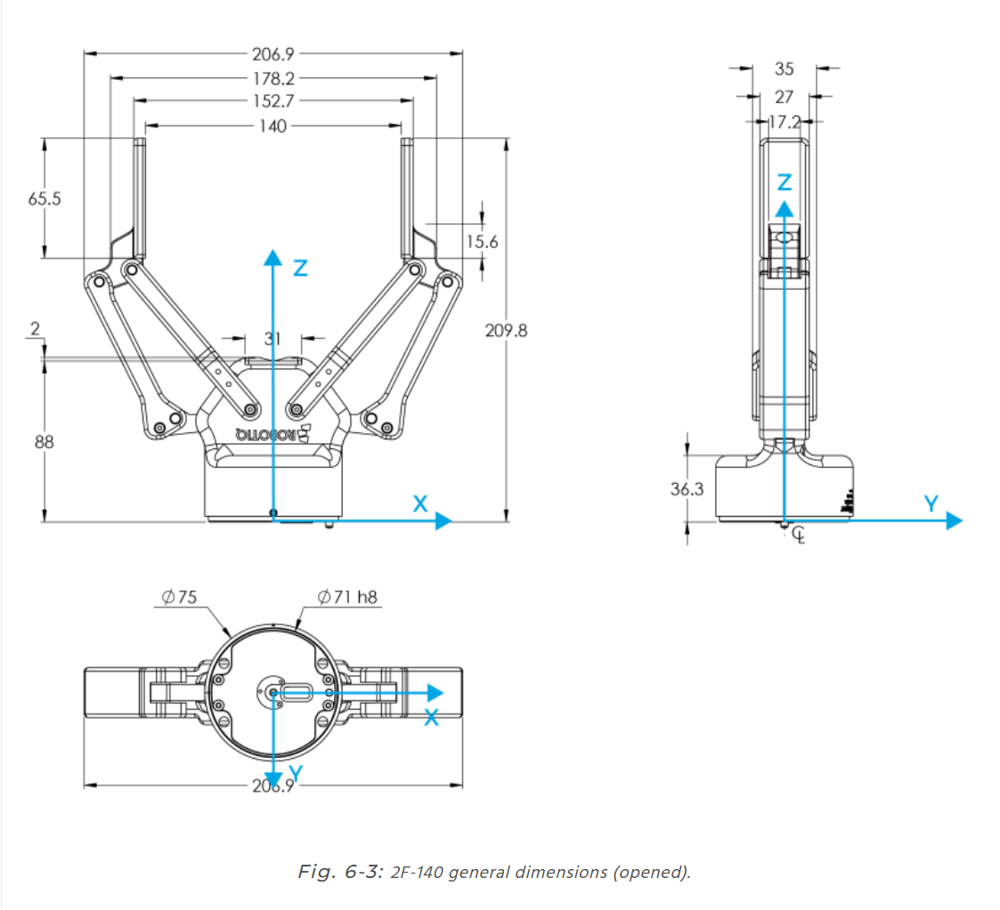
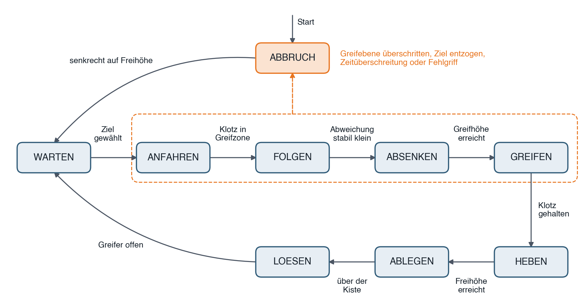
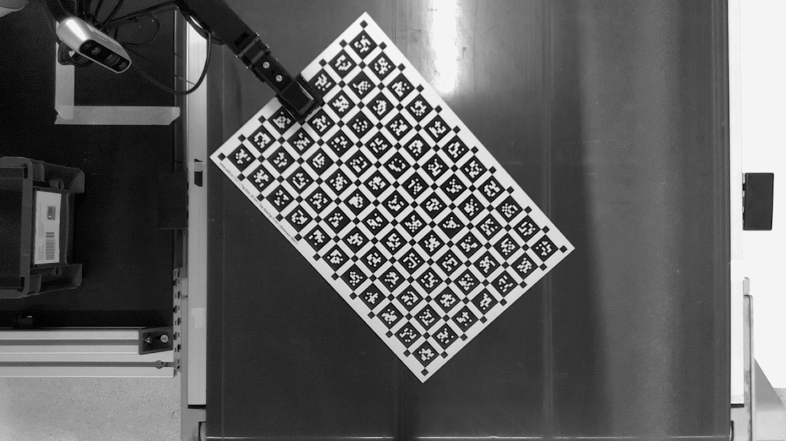
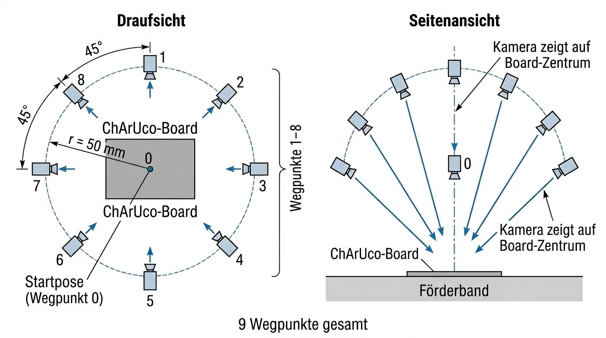

# 1 Einleitung

## 1.1 Ausgangslage und Motivation

Das Projekt erweitert ein bestehendes System zum Greifen und Sortieren von
Klötzen auf einem bewegten Förderband. Ein duales Kamerasystem ermittelt die
Positionen und Geschwindigkeiten der ankommenden Objekte. Das ursprüngliche
System berechnete daraus einen festen Abgriffpunkt. Der Roboter fuhr diese
Position an und wartete dort auf das Objekt.

Diese Prozessführung begrenzt die Zahl der Klötze, die der Roboter verarbeiten
kann. Besonders bei kurzen Abständen zwischen den Klötzen bleibt wenig Zeit
für die nächste Positionierung. Der Roboter soll deshalb nicht an einem festen
Punkt warten. Er soll sich mit dem ausgewählten Klotz mitbewegen und ihn aus
der Bewegung heraus greifen.

Damit wird die Handhabung flexibler. Das System soll mehrere gleiche oder
unterschiedliche Klötze gleichzeitig unterscheiden und nacheinander
bearbeiten. Es muss selbst entscheiden, welcher Klotz innerhalb des
verbleibenden Arbeitsbereichs noch sicher erreichbar ist. Nicht mehr
erreichbare Klötze bleiben auf dem Förderband. Die Positions- und
Geschwindigkeitsschätzung erfolgt dabei ausschließlich auf Basis der Bilddaten
([src-projekt-inversetetris-aufgabenstellung](../referenzen/quellen/src-projekt-inversetetris-aufgabenstellung.md)).

Die Aufgabenstellung sieht außerdem den grundsätzlichen Funktionsnachweis bei
unterschiedlichen Bandgeschwindigkeiten vor. Daraus ergeben sich hohe
Anforderungen an die zeitliche Abstimmung von Erkennung, Zielauswahl und
Roboterbewegung. Der Bericht untersucht, wie diese Anforderungen im aktuellen
Versuchsaufbau umgesetzt und bewertet werden.

## 1.2 Zielsetzung des Projekts

Ziel des Projekts ist ein Konzeptnachweis für das kamerabasierte Greifen von
quaderförmigen Klötzen auf einem bewegten Förderband. Die Positions- und
Geschwindigkeitsschätzung soll ausschließlich aus Bilddaten entstehen. Ein
Encoder oder ein vergleichbares Signal des Förderbands ist dafür nicht
vorausgesetzt. Der Roboter soll die Klötze während ihrer Bewegung greifen
([src-projekt-inversetetris-aufgabenstellung](../referenzen/quellen/src-projekt-inversetetris-aufgabenstellung.md)).

Neben dem Greifvorgang soll das System die Klötze nach Form und Farbe
kategorisieren. Die Kategorisierung dient der flexiblen Objektbeschreibung,
nicht einer Ablageaufgabe. Sie soll die Übertragbarkeit des Konzepts auf
weitere vergleichbare Anwendungsfälle ermöglichen. Befinden sich mehrere
Klötze gleichzeitig auf dem Förderband, soll das System selbstständig einen
noch erreichbaren Klotz auswählen. Klötze, die innerhalb des verbleibenden
Arbeitsbereichs nicht sicher erreichbar sind, werden nicht mehr als Ziel
verfolgt.

Der Funktionsnachweis steht im Mittelpunkt. Ein fertiges Industrieprodukt und
ein unter allen Bedingungen zuverlässig arbeitendes System sind nicht Ziel des
Projekts. Die Anlage wird dennoch bei unterschiedlichen Bandgeschwindigkeiten
getestet. Damit wird untersucht, wie sich die Bandgeschwindigkeit auf das
Greifen auswirkt.

Ein Förderband mit variabler Geschwindigkeit war für den Aufbau vorgesehen,
wurde jedoch innerhalb des Projektrahmens nicht in die Anlage integriert. Die
Bewertung erfolgt deshalb mit dem vorhandenen Förderband. Dieses ermöglicht
auch höhere Bandgeschwindigkeiten. Reflexionen und die daraus entstehenden
Störungen der Bildverarbeitung werden dabei als relevante Randbedingung der
Versuche betrachtet.

<!-- Merker für Kapitel 4 und 6: Die automatische Auswahl erreichbarer Klötze
ist im aktuellen Stand umgesetzt. Umsetzung und Funktionsnachweis mit eigenen
Messdaten beschreiben. -->

<!-- Merker für Kapitel 6 und 7: Mit dem schnelleren vorhandenen Förderband
sind die Projektziele trotz höherer Geschwindigkeit und Reflexionen erreichbar.
Die Aussage nur mit dokumentierten Versuchsbedingungen und Ergebnissen belegen. -->

## 1.3 Abgrenzung und Rahmenbedingungen

Die Projektarbeit ist auf einen Konzeptnachweis im vorhandenen Versuchsaufbau
begrenzt. Sie umfasst das Erkennen, Auswählen und Greifen quaderförmiger
Klötze auf dem bewegten Förderband. Zum Funktionsnachweis gehören das Anheben
eines erfolgreich gegriffenen Klotzes und seine sichere Ablage an einem
vorgegebenen Abgabeort.

Die Form- und Farbkategorisierung unterstützt die Beschreibung und Auswahl der
Klötze. Eine vollständige Sortier- oder Ablageanlage gehört nicht zum
Projektumfang. Ebenso wird kein fehlerfreies Greifen aller Klötze gefordert.
Das System darf Klötze verwerfen, wenn diese im verbleibenden Arbeitsbereich
nicht sicher erreichbar sind ([src-projekt-inversetetris-aufgabenstellung](../referenzen/quellen/src-projekt-inversetetris-aufgabenstellung.md)).

Das neue Förderband mit variabler Geschwindigkeit wurde innerhalb des
Projektrahmens nicht in die Anlage integriert. Die Versuche erfolgen deshalb
mit dem vorhandenen Förderband bei ausgewählten Geschwindigkeiten. Die
Ergebnisse gelten für den bestehenden Arbeitsraum sowie die vorhandenen
Lichtverhältnisse und Reflexionen. Das Projekt zielt nicht auf den Nachweis
einer vollständigen industriellen Anwendung.

<!-- Merker für 2.1.3: Die Roboterkamera gehört zum Systemaufbau. Sie darf als
optionales Korrektursignal verwendet werden, ist aber nicht Voraussetzung für
den erfolgreichen Greifablauf. Details zu ihrem derzeitigen Einsatz und ihren
Grenzen später beschreiben. -->

## 1.4 Aufbau des Berichts

Zunächst werden die technischen Voraussetzungen des Versuchsaufbaus erläutert.
Dazu gehören die eingesetzte Hardware, die Koordinatensysteme und der
Softwareaufbau. Darauf aufbauend beschreibt der Bericht das Konzept, mit dem
die Bilddaten in eine dynamische Greifbewegung überführt werden.

Anschließend folgt die Umsetzung der einzelnen Komponenten. Die Inbetriebnahme
zeigt, welche Parameter und Anpassungen für das Zusammenspiel von Kamera,
Regelung und Roboter erforderlich waren. Die Versuchsergebnisse bewerten den
Funktionsnachweis unter den definierten Bedingungen. Abschließend ordnet der
Bericht die erreichten Ergebnisse ein und leitet weitere technische Schritte
ab.

## 2 System und Versuchsaufbau

### 2.1 Hardwareaufbau

#### 2.1.1 Allgemeine Geometrie und Aufbau

Der Versuchsaufbau besteht aus einem Förderband, dem seitlich angeordneten
UR10e mit Greifer, einer Base-Kamera und einer Ablagekiste. In Bandlaufrichtung
steht der Roboter auf der linken Seite nahe dem Bandende. Die Ablagekiste liegt
links neben dem Förderband und in Bandlaufrichtung vor dem Roboter. Ihre
Ablageposition beträgt im globalen Bezugssystem `world`
`x = -0,316 m`, `y = 0,476 m` und `z = 0,420 m`.

Als Base-Kamera wird eine Intel RealSense L515 eingesetzt. Sie kombiniert eine
RGB-Kamera mit einem LiDAR-Tiefensensor. Die Tiefenmessung basiert auf einem
abtastenden Infrarotlaser. Damit stehen Farbinformationen zur Kategorisierung
und Tiefeninformationen zur räumlichen Einordnung der Klötze zur Verfügung
[src-intel-realsense-l515-spezifikation](../referenzen/quellen/src-intel-realsense-l515-spezifikation.md),
[src-realsense-l515-datenblatt](../referenzen/quellen/src-realsense-l515-datenblatt.md).
Die Kamera ist mittig über dem Bandanfang montiert. Ihr Abstand zur
Bandebene beträgt etwa `0,85 m`. Sie erfasst die Klötze vor dem Greifbereich.

Zusätzlich ist eine Intel RealSense D435i am Roboterflansch neben der Aufnahme
für den Greifer montiert. Ihre optische Achse ist gegenüber der Flanschmitte
parallel versetzt und erfasst den Bereich unmittelbar vor dem Greifer. Die
Kamera besitzt neben einem RGB-Sensor ein aktives Infrarot-Stereosystem zur
Tiefenmessung sowie eine integrierte inertiale Messeinheit. Sie kann die
Basiskamera bei der Feinortung ergänzen, ist für den nachgewiesenen Greifablauf
jedoch nicht erforderlich
[src-intel-realsense-d435i-spezifikation](../referenzen/quellen/src-intel-realsense-d435i-spezifikation.md),
[src-realsense-d400-datenblatt](../referenzen/quellen/src-realsense-d400-datenblatt.md).

Für die anfängliche Kalibrierung wurde das Bezugssystem `conveyor_frame`
definiert. Sein Ursprung liegt mittig am Bandanfang. Die X-Achse zeigt, in
Bandlaufrichtung betrachtet, nach rechts. Die Y-Achse zeigt in
Bandlaufrichtung, die Z-Achse von der Bandebene nach oben. Im Rahmen der
Anwendung werden ausschließlich die globalen Koordinaten des Bezugssystems
`world` verwendet. Dieses ist das von der UR10e-Steuerung verwendete System,
dessen Ursprung in der Roboterbasis liegt. Alle folgenden Koordinaten beziehen
sich auf dieses System. Die unterschiedlichen Koordinatenkonventionen von
`conveyor_frame` und `world` ergeben sich aus der zeitlichen Zusammenführung
der Teilprojekte.

Die nutzbare gerade Förderstrecke beträgt ungefähr `1,50 m` bei einer Breite
von etwa `0,80 m`. Das Förderband ist physisch etwas länger. Die gekrümmten
Bereiche über den Bandrollen stehen jedoch nicht als Greifbereich zur
Verfügung. Die Bandkanten liegen im globalen System ungefähr bei
`x = -1,275 m` und `x = -0,480 m`. Der für das Greifen nutzbare rechteckige
Bereich reicht von `x = -1,200 m` bis `-0,530 m` sowie von
`y = -0,320 m` bis `0,430 m`. Er wird in der Draufsicht als Arbeitsbereich
dargestellt. Der festgelegte Arbeitsraum des Flansches erweitert diesen
Bereich für die Ablage der Objekte auf `x = -1,000 m` bis `-0,300 m` und
`y = -0,320 m` bis `0,480 m`.

Die räumliche Anordnung des realen Aufbaus zeigen die Abbildungen
`fig-aufbau-gesamtansicht-1` und `fig-aufbau-gesamtansicht-2`.
Die Lage von Förderband, Kamera, Roboter, Ablagekiste und Arbeitsbereich wird
in Abbildung `fig-systemaufbau-draufsicht` schematisch verdeutlicht.

Die festgelegten zulässigen Höhen im Arbeitsbereich des Flansches betragen `z = 0,309 m` , womit sich der geschlossene Greifer knapp über der Oberfläche des Förderbandes befindet, und
`z = 0,600 m`. Die Bewegung, mit der den fahrenden Objekten auf dem Fließband gefolgt wird, erfolgt auf `z = 0,450 m`, für den Transfer
zur Ablage wird eine Freihöhe von `z = 0,490 m` verwendet. Die untere
Z-Grenze hält die geschlossene Backenspitze mit einem Abstand von `10 mm` über
der Bandebene. Oberhalb von `z = 0,600 m` wurde im hinteren Bereich des
Arbeitsraums eine mögliche Singularität beobachtet zudem wird die Höhe durch die ber dem Förderband befindliche Base-Kamera limitiert.

Die zugehörigen Höhen und die Position der Basiskamera über dem Förderband sind
in Abbildung `fig-systemaufbau-seitenansicht` dargestellt.

<!-- Word-Übernahme Skizzen: `fig-systemaufbau-draufsicht` und
`fig-systemaufbau-seitenansicht` nach den jeweiligen Textverweisen einfügen.
Die Beschriftungen beruhen auf der Konfiguration vom 24.09.2026.
Bildunterschrift `fig-systemaufbau-draufsicht`: Draufsicht mit Förderband,
Base-Kamera, Ablagekiste, Arbeitsbereich sowie den Bezugssystemen
`conveyor_frame` und `world`.
Bildunterschrift `fig-systemaufbau-seitenansicht`: Seitenansicht mit
Base-Kamera sowie Arbeitsraum-, Folge- und Transferhöhen im Bezugssystem
`world`. -->

<!-- Word-Übernahme Gesamtaufnahmen: `fig-aufbau-gesamtansicht-1` und
`fig-aufbau-gesamtansicht-2` unmittelbar nach dem Textverweis einfügen.
Bildunterschrift `fig-aufbau-gesamtansicht-1`: Versuchsaufbau mit Förderband,
UR10e und Ablagekiste.
Bildunterschrift `fig-aufbau-gesamtansicht-2`: Arbeitsbereich des Roboters
über dem Förderband. -->

#### 2.1.2 UR10e

Die zentrale Handhabungseinheit des Aufbaus ist ein UR10e von Universal Robots.
Der Roboter besitzt sechs rotierende Gelenke. Seine Reichweite beträgt
`1.300 mm`, die maximale Nutzlast `12,5 kg`
([src-universalrobots-ur10e-technische-daten](../referenzen/quellen/src-universalrobots-ur10e-technische-daten.md)).
Die Wiederholgenauigkeit ist mit `±0,05 mm` angegeben. Sie beschreibt die
Wiederholbarkeit des Roboterarms und nicht die absolute Genauigkeit des
gesamten kamerabasierten Greifprozesses. Der UR10e trägt den Greifer und
positioniert ihn über dem Förderband sowie am vorgegebenen Abgabeort.

Der UR10e ist für kollaborative Anwendungen ausgelegt. Seine
Sicherheitsfunktionen können unter anderem Grenzen für Geschwindigkeit, Kraft,
Impuls und Leistung überwachen. Wird eine konfigurierte Grenze überschritten
oder ein Sicherheitsfehler erkannt, wird die Roboterbewegung sicher
unterbrochen
([src-universalrobots-ur10e-sicherheitsfunktionen](../referenzen/quellen/src-universalrobots-ur10e-sicherheitsfunktionen.md)).
Ob der Aufbau ohne trennende
Schutzeinrichtung betrieben werden darf, ergibt sich jedoch erst aus der
Risikobeurteilung des gesamten Systems. Dabei müssen insbesondere Greifer,
Klötze, Bewegungen und Quetschstellen berücksichtigt werden. Der Endeffektor
ist nicht automatisch durch die Sicherheitsfunktionen des Roboterarms
abgedeckt
([src-universalrobots-ur10e-risikobeurteilung](../referenzen/quellen/src-universalrobots-ur10e-risikobeurteilung.md)).

#### 2.1.3 Robotiq-2F-140-Greifer

Am Flansch des UR10e ist ein adaptiver Zweifingergreifer vom Typ
Robotiq 2F-140 montiert. Die Herstellerabmessungen des geöffneten Greifers
zeigt Abbildung `fig-greifer-robotiq-2f140-abmessungen`
([src-robotiq-2f140-spezifikation](../referenzen/quellen/src-robotiq-2f140-spezifikation.md)).

<!-- Word-Übernahme: `fig-greifer-robotiq-2f140-abmessungen` an dieser Stelle
einfügen.
Bildunterschrift: Herstellerabmessungen des geöffneten
Robotiq-2F-140-Greifers (Quelle: `src-robotiq-2f140-spezifikation`). -->

*Abbildung `fig-greifer-robotiq-2f140-abmessungen`: Herstellerabmessungen des
geöffneten Robotiq-2F-140-Greifers (Quelle:
`src-robotiq-2f140-spezifikation`).*

Jeder Finger besteht aus zwei starren Abschnitten. Diese Abschnitte werden
Phalangen genannt und sind über ein Gelenk verbunden. Ein einziger Antrieb
bewegt beide Finger. Der Greifer besitzt damit weniger Antriebe als Gelenke.
Beim Schließen drehen sich die Phalangen um ihre Gelenke. Die Greifflächen
folgen deshalb einer gekrümmten Bahn und nicht einer geraden parallelen
Bewegung. Abhängig von Geometrie und Lage des Klotzes entsteht ein paralleler
oder umschließender Griff
([src-robotiq-2f140-handbuch](../referenzen/quellen/src-robotiq-2f140-handbuch.md)).

Ein Klotz kann deshalb an seinen Seiten nicht beliebig tief gegriffen werden.
Bei einem zu tiefen seitlichen Eingriff würden die Phalangen beim Schließen mit
der Oberseite des Klotzes kollidieren. Die Greiftiefe ist somit durch die
Fingergeometrie begrenzt. Außerdem verändert sich die räumliche Höhe des
Greifers zwischen offenem und geschlossenem Zustand. Der zulässige Arbeitsraum
und die Greifhöhe müssen diese Zustandsänderung berücksichtigen.

Schließgeschwindigkeit und Schließkraft sind einstellbar. Der Kraftwert
begrenzt den maximalen Motorstrom und damit die beim Schließen verfügbare
Greifkraft. Treffen die Finger auf einen Widerstand und wird diese Grenze
erreicht, hält der Greifer an. Sein Gerätestatus meldet den Kontakt als
erkannte Objektaufnahme. Bei geeigneter Kraftkonfiguration kann die integrierte
Nachgreiffunktion einen späteren Objektverlust erkennen und die Finger weiter
schließen
([src-robotiq-2f140-handbuch](../referenzen/quellen/src-robotiq-2f140-handbuch.md)).

Die tatsächlich nutzbare Öffnungsweite wurde am aufgebauten System mit
`127 mm` gemessen. An den Fingerendgliedern sind 3D-gedruckte Aufsätze mit
Gummi-Grippmatten montiert. Die Greiffläche jeder Matte beträgt
`20 mm × 15 mm`.

Vor dem Betrieb wird der Öffnungsbereich des Greifers kalibriert. Dadurch ist
die Öffnungsweite im aufgebauten System als Millimeterwert verfügbar. Der
Greifer ist über USB mit dem Rechner verbunden. Er wird damit extern
angesteuert und nicht über die direkte Roboteransteuerung bedient.

#### 2.1.4 Förderband und Klötze

Das Förderband führt die Klötze vom manuellen Auflagepunkt am Bandanfang durch
den Erfassungsbereich der Basiskamera zur Greifzone. Die Geschwindigkeit bleibt
während eines Versuchs konstant. Vor Versuchsbeginn können verschiedene
Geschwindigkeitsstufen eingestellt werden. Eine Stoppuhrmessung der niedrigsten
Einstellung, Stufe 1, ergab Werte zwischen `125 mm/s` und `133 mm/s`
([src-projekt-foerderband-kloetze](../referenzen/quellen/src-projekt-foerderband-kloetze.md)).
Die gemessene Geschwindigkeit dient später als Gegenprobe für die aus den
Bilddaten geschätzte Bandgeschwindigkeit.

Für die Versuche wurden ausschließlich quaderförmige, 3D-gedruckte Klötze
verwendet. Der am häufigsten verwendete flache Klotz besitzt die Abmessungen
`25 mm × 50 mm × 75 mm`. Daneben kamen ein großer Quader mit
`100 mm × 50 mm × 50 mm` sowie Würfel mit einer Kantenlänge von `50 mm` zum
Einsatz. Die Klötze sind rot, blau, weiß oder schwarz. Ihre Oberseiten sind
überwiegend matt, während einzelne Seitenflächen stärker reflektieren
([src-projekt-foerderband-kloetze](../referenzen/quellen/src-projekt-foerderband-kloetze.md)).

Die Klötze können stehend, liegend, flach oder gedreht auf dem Band liegen.
Runde Klötze wurden bewusst ausgeschlossen. Ihre Orientierung lässt sich mit
dem gewählten Ansatz nicht eindeutig erfassen und ist für den vorgesehenen
Greifablauf nicht erforderlich. Die verwendeten Geometrien begrenzen den
Funktionsnachweis damit auf quaderförmige Objekte.

#### 2.1.5 Basiskamera

Die Basiskamera ist die zentrale Sensorik des finalen Greifablaufs. Sie erfasst
die Klötze am Bandanfang, bevor sie die Greifzone erreichen. Die Intel
RealSense L515 liefert ein RGB-Bild mit `1.280 × 720 Pixel` bei `15 Hz` und
ein Tiefenbild mit `640 × 480 Pixel` bei `30 Hz`. Die unterschiedliche Rate
ergibt sich aus dem verwendeten Tiefenprofil der L515
([src-projekt-basiskamera-konfiguration](../referenzen/quellen/src-projekt-basiskamera-konfiguration.md)).

Der sichtbare Bandbereich reicht im Bezugssystem `world` ungefähr von
`y = +1,03 m` bis `y = +0,46 m`. Die Greifzone beginnt unmittelbar hinter
diesem Bildbereich. Der Roboter und sein Greifer verdecken die Kamera damit
während des Greifvorgangs nicht. Die weitere Führung eines erkannten Klotzes
bis zur Greifzone wird erst im Kapitel zum Greifkonzept beschrieben.

Die L515 ist auf einem Gestell über dem Förderband montiert. Die Befestigung
ist nicht ausreichend steif, um ihre Lage nach Änderungen am Aufbau dauerhaft
als unveränderlich anzunehmen. Bereits kleine Lageänderungen beeinflussen die
Umrechnung der Kameramessung in das Bezugssystem `world`. Deshalb ist ein
einfach ausführbares und wiederholbares Kalibrierverfahren für den Aufbau
erforderlich. Das Kalibrierverfahren selbst wird in Kapitel 4 erläutert
([src-projekt-basiskamera-konfiguration](../referenzen/quellen/src-projekt-basiskamera-konfiguration.md)).

#### 2.1.6 Roboterkamera

Zusätzlich zur Basiskamera ist eine Intel RealSense D435i am Roboterflansch
montiert. Sie sitzt neben der Aufnahme des Greifers. Ihre optische Achse ist
gegenüber der Flanschmitte parallel versetzt und erfasst den Bereich direkt vor
dem Greifer. Die Kamera bewegt sich damit gemeinsam mit dem Roboter und kann
für eine Feinortung kurz vor dem Greifen genutzt werden. Sie stellt dafür ein
RGB-Bild sowie Tiefendaten aus einem aktiven Infrarot-Stereosystem bereit
([src-intel-realsense-d435i-spezifikation](../referenzen/quellen/src-intel-realsense-d435i-spezifikation.md),
[src-realsense-d400-datenblatt](../referenzen/quellen/src-realsense-d400-datenblatt.md)).

Im finalen Greifablauf ist die Roboterkamera nicht in den aktiven Regelpfad
eingebunden. Die Lokalisierung und Verfolgung der Klötze erfolgt mit der
Basiskamera. Die Gründe für diese Entscheidung und der mögliche spätere Einsatz
der Roboterkamera werden in den folgenden Kapiteln behandelt
([src-projekt-roboterkamera-einbindung](../referenzen/quellen/src-projekt-roboterkamera-einbindung.md)).

### 2.2 Koordinatensysteme und Greifgeometrie

#### 2.2.1 Bezugssystem `world`, Roboterbasis und Flansch `ur_tool0`

Alle Positionsangaben des Regelpfads beziehen sich auf das globale
Bezugssystem `world`. Sein Ursprung liegt in der physischen Roboterbasis. Das
System ist fest mit dem Roboter verbunden und bewegt sich nicht mit dem
Förderband. Die Förderbewegung erfolgt im Aufbau näherungsweise in negative
Y-Richtung von `world`. Das Förderband liegt gemäß Abbildung
`fig-systemaufbau-draufsicht` seitlich der Roboterbasis im Bereich negativer
X-Koordinaten, ungefähr zwischen `x = -1,275 m` und `x = -0,480 m`. Die
Z-Achse zeigt nach oben. Die Bandoberfläche liegt bei `z = 0,054 m`
([src-projekt-bezugssysteme](../referenzen/quellen/src-projekt-bezugssysteme.md)).

Für die anfängliche Kamerakalibrierung wurde zusätzlich das Bezugssystem
`conveyor_frame` verwendet. Sein Ursprung liegt mittig am Bandanfang. Seine
Y-Achse zeigt in Bandlaufrichtung. Die X-Achse zeigt, in Bandlaufrichtung
betrachtet, nach rechts. Die Z-Achse zeigt von der Bandebene nach oben. Im
finalen Betrieb wird dieses Bezugssystem nicht verwendet. Kameramessung,
Zielauswahl und Roboterbewegung werden einheitlich in `world` verarbeitet.
Dadurch entfällt im Regelpfad eine
zusätzliche Umrechnung zwischen Band und Roboter.

Die Robotersteuerung liefert als geregelte Pose die Lage des Flansches
`ur_tool0`. Sie ist von einem in der UR-Steuerung konfigurierten TCP zu
unterscheiden. Die daraus folgende Lage des tatsächlichen Griffpunkts wird im
nächsten Abschnitt bestimmt. Die räumliche Zuordnung von Roboterbasis, Flansch
`ur_tool0` und Griffpunkt zeigt Abbildung `fig-koord-systeme`.

<!-- Word-Übernahme: `fig-koord-systeme` nach dem vorstehenden Textverweis
einfügen. Die Abbildung muss Roboterbasis, `world-Y−`, `world-Z+`, Flansch
`ur_tool0` und Griffpunkt eindeutig unterscheiden.
Bildunterschrift: Seitenansicht des Roboters mit Bezugssystem `world`, Flansch
`ur_tool0` und Griffpunkt. -->

#### 2.2.2 TCP, Flansch und Griffpunkt

Der Greifer ist in der regulären Greifpose senkrecht nach unten ausgerichtet.
Der Klotz wird mittig zwischen den Backen auf Höhe der Auflageflächen gegriffen.
Für die Kalibrierung ist die Flanschposition bei geschlossenem Greifer
maßgebend.

Vom Flansch bis zur geschlossenen Backenspitze wurden `0,245 m` gemessen. Dieser
Abstand dient zur Bestimmung der Bandhöhe und zur Beurteilung des Abstandes zum
Förderband. Die Auflageflächen der Backen sind `20 mm` hoch. Der für die
Greifbewegung verwendete Griffpunkt liegt in ihrer Mitte. Sein Abstand zum
Flansch beträgt damit `0,235 m` ([src-projekt-greifgeometrie](../referenzen/quellen/src-projekt-greifgeometrie.md)).

Die erkannte Klotzposition beschreibt den Griffpunkt, nicht die Flanschpose.
Der `object_follower` addiert daher den festen Versatz von `0,235 m` in
Z-Richtung auf die berechnete Greifposition. Da der Greifer senkrecht bleibt und
der Griffpunkt auf der Flanschachse liegt, ist keine weitere räumliche
Transformation erforderlich. Die sich beim Öffnen und Schließen verändernde
Greifergeometrie wird im folgenden Abschnitt beim Arbeitsraum betrachtet.

#### 2.2.3 Bandhöhe, Arbeitsraum und Greifzone

Die Bandoberfläche liegt bei `z = 0,054 m` im Bezugssystem `world`
([src-projekt-bezugssysteme](../referenzen/quellen/src-projekt-bezugssysteme.md)).
Die im Projekt hinterlegten Arbeitsraumgrenzen bilden den zulässigen Raum für
Flanschzielposen im Bezugssystem `world`. Sie begrenzen damit auch den Raum, in
dem die Greifzone liegen darf. Der Flansch wurde hierfür am Aufbau per
Handführung über den Bandbereich bewegt. Die Grenzen wurden so gewählt, dass
keine Kollision und keine auffällige Singularität auftrat. Sie betragen
`x = -1,000 m` bis `-0,300 m`, `y = -0,320 m` bis `0,480 m` und
`z = 0,299 m` bis `0,600 m`.

Die Ablagepose des Flansches liegt bei `x = -0,316 m`,
`y = 0,476 m` und `z = 0,420 m`. Sie liegt innerhalb des Arbeitsraums.
Die Grenzen wurden in positive Y-Richtung und zu größeren X-Werten gezielt bis
zu dieser Position erweitert. Die Ablagebox ist damit kein Bereich außerhalb
des zulässigen Arbeitsraums.

Die Warte- und Beobachtungsposition des Flansches liegt bei
`x = -0,816 m`, `y = 0,350 m` und `z = 0,450 m`. Die Backen sind dort mit einer
Gier von `90°` quer zur Bandrichtung ausgerichtet. Die Position befindet sich
am Beginn der Greifzone über der Bandmitte. Ohne ausgewähltes Ziel wartet der
Roboter dort und beobachtet die einfahrenden Klötze.

Die Greifzone ist eine engere Teilmenge des Arbeitsraums. Sie umfasst auf dem
Förderband den Bereich von `x = -1,000 m` bis `-0,530 m` und von
`y = -0,320 m` bis `0,445 m`. Die Erweiterung des Arbeitsraums in positive
Y-Richtung und zu größeren X-Werten dient ausschließlich der Ablagebox. Sie
wird bei der Zielauswahl auf dem Förderband nicht verwendet. Die räumliche
Anordnung von Förderband, Roboter und Ablagebox zeigt Abbildung
`fig-systemaufbau-draufsicht`
([src-projekt-arbeitsraum-greifzone](../referenzen/quellen/src-projekt-arbeitsraum-greifzone.md)).

Nach einem erfolgreichen Griff fährt der Flansch auf die Transferhöhe
`z = 0,490 m`. Der Roboter bewegt sich zunächst noch mit der letzten
Bandgeschwindigkeit, bis der Klotz die Bandoberfläche verlassen hat. Anschließend
hebt er senkrecht auf die Transferhöhe und fährt erst danach zur Ablagebox.

Die gekrümmte Bewegung der Greiferphalangen verändert beim Öffnen und Schließen
den räumlichen Bauraum des Greifers. Die Arbeitsraumgrenzen müssen daher für
beide Greiferzustände betrachtet werden. Für diese Abgrenzung wird kein
zusätzlicher Höhenwert verwendet.

### 2.3 Softwareumgebung

#### 2.3.1 AICA und ROS 2

Die Projektanwendung basiert auf dem AICA System. AICA Core stellt einen
vorkonfigurierten Robotik-Workspace mit Komponenten, Controllern und
Hardware-Interfaces bereit. AICA Studio dient als grafische Umgebung, um diese
Bausteine zu einer Anwendung zu verbinden, zu konfigurieren und zu überwachen.
Das System baut auf ROS 2 auf. ROS 2 übernimmt dabei die Kommunikation zwischen
den Prozessen sowie die Anbindung von Kameras und Roboterhardware
([src-aica-system-uebersicht](../referenzen/quellen/src-aica-system-uebersicht.md)).

Die verwendete Anwendung basiert auf dem AICA-Systemabbild `v2.0.5-jazzy` mit
AICA Core `v5.0.0`. AICA-Komponenten werden periodisch ausgeführt. Ihre
Arbeitsrate, Parameter, Eingangssignale und Ausgänge sind innerhalb der
Anwendung festgelegt
([src-aica-komponenten](../referenzen/quellen/src-aica-komponenten.md),
[src-projekt-softwareumgebung](../referenzen/quellen/src-projekt-softwareumgebung.md)).

#### 2.3.2 Komponentenstruktur

Die Projektspezifik ist in eigenen Python-Komponenten umgesetzt. Sie kapseln
Erkennung, Bahnverfolgung, Zielauswahl, Greifablauf und Diagnose. Die zugehörige
Fachlogik ist von den ROS-Schnittstellen getrennt. Dadurch können die
Berechnungen unabhängig von der Laufzeitumgebung geprüft werden. Alle eigenen
Python-Komponenten laufen gemeinsam in einem Prozess. Ihre Callbacks dürfen
deshalb die periodische Verarbeitung nicht blockieren
([src-projekt-softwareumgebung](../referenzen/quellen/src-projekt-softwareumgebung.md)).

AICA ergänzt diese Komponenten um die Hardwareanbindung und die
Bewegungsumsetzung. Dazu gehören die Schnittstelle zum UR10e, der
Inverse-Kinematik-Controller und der Signal Point Attractor. Die konkrete
Aufgabenverteilung der Komponenten und Controller wird in Kapitel 3 beschrieben.

#### 2.3.3 Signal- und Datenfluss

Die Komponenten tauschen ihre Daten über AICA-Signale aus. Diese bilden eine
periodische Abstraktion für die Datenübertragung und können mit ROS-2-Topics
verbunden werden. Im Projekt sind Aufbau und Bedeutung der Datenfelder zentral
in Datenverträgen festgelegt. Dazu gehören Einheiten, Feldreihenfolge und
Zeitstempel. Dadurch verwenden Sender und Empfänger dieselbe Bedeutung eines
Signals
([src-aica-signale](../referenzen/quellen/src-aica-signale.md),
[src-projekt-softwareumgebung](../referenzen/quellen/src-projekt-softwareumgebung.md)).

Der Datenfluss verbindet die Bildverarbeitung, die Berechnung der Objektbahn,
die Zielauswahl und die Bewegungsregelung. Die vollständige Kette sowie die
einzelnen Signale werden im folgenden Kapitel erläutert.

## 3 Greifkonzept und Umsetzung

### 3.1 Funktionskette des Pick-on-the-Fly

Der Prozess beginnt bei der Basiskamera. Diese erfasst nur den Anfang des
Förderbands. Die Greifzone liegt in Bandlaufrichtung dahinter und außerhalb des
Kamerabilds. Der Roboter greift einen Klotz deshalb an einer Stelle, an der er
nicht mehr gemessen wird. Das Konzept beruht darauf, Lage und Geschwindigkeit im Kamerabild so genau zu
bestimmen, dass die weitere Bewegung des Klotzes vorhergesagt werden kann.

Daraus ergibt sich eine Kette von fünf Schritten. `base_cam` erkennt und
vermisst die Klötze im Kamerabild. `vectoring` schätzt ihre Geschwindigkeit und
berechnet ihre Position über das Kamerabild hinaus weiter. Der `priority_handler` ermittelt
den nächsten erreichbaren Klotz. Der `object_follower` führt den Greifer über
den Klotz, greift ihn mitfahrend und legt ihn in der Ablagekiste ab.
Die Komponente `robotiq_gripper` steuert den Greifer. Das Ergebnis jedes
Greifversuchs geht an den `priority_handler` zurück, der daraufhin das nächste
Ziel wählt.

Für Bahnführung und Regelung des Roboters werden vorhandene AICA-Bausteine genutzt.

Die Komponenten arbeiten mit unterschiedlichen Raten. Bildverarbeitung und
Schätzung laufen mit 15 Hz, der Bildrate der Kamera. Die Zielauswahl arbeitet
mit 20 Hz, die Bahnführung mit 50 Hz. Die Regelung des Roboters läuft mit
500 Hz. Die Roboterkamera am Flansch wird für den Greifablauf nicht benötigt.
Gegriffen wird ausschließlich auf Grundlage der Basiskamera. Die Raten sind
entsprechend der genutzten Hardware gewählt
([src-projekt-greifablauf](../referenzen/quellen/src-projekt-greifablauf.md)).

### 3.2 Erkennung, Vermessung und Vorhersage

#### 3.2.1 `base_cam` und Objektdaten

`base_cam` wertet Farb- und Tiefenbild der Basiskamera aus. Im Tiefenbild gilt
alles als Objekt, was innerhalb eines festgelegten Bildausschnitts eine
Mindesthöhe über der Bandoberfläche überschreitet. Aus dem Umriss jedes Objekts
wird das
kleinste umschließende Rechteck bestimmt. Es liefert Mittelpunkt, Länge, Breite
und Drehwinkel des Klotzes. Die Tiefe der Oberseite ergibt sich als Median über
den Umriss. Randpixel, die bereits das Band messen, verfälschen die Höhe
dadurch nicht. Die Farbe wird im Farbbild über den Farbton bestimmt.

Mit der Kalibrierung (Kapitel 4) rechnet `base_cam` alle Werte in das
Bezugssystem `world` um. Die Messungen aufeinanderfolgender Bilder werden
einander zugeordnet, und jeder Klotz erhält eine feste Kennung. Farbe und
Abmessungen werden je Klotz erfasst. Die Zielauswahl nutzt lediglich die
Abmessungen und die Position.

Die Position eines Klotzes streut von Bild zu Bild nur um Bruchteile eines
Millimeters. Die gemessene Grundfläche schwankt dagegen deutlich. Geometrische
Prüfungen erfolgen deshalb erst auf den geglätteten Werten aus `vectoring`.

#### 3.2.2 `vectoring` und Geschwindigkeits- und Positionsschätzung

Die Bandgeschwindigkeit wird aus den Bilddaten geschätzt. `vectoring` verfolgt
dazu für jeden Klotz den Verlauf seiner Position über der Zeit.

Ein aufgelegter Klotz kann beim Aufsetzen kippen oder noch schwanken. Seine ersten
Messungen sind für eine Geschwindigkeitsschätzung deshalb ungeeignet.
`vectoring` teilt die jüngsten Messungen in zwei aufeinanderfolgende Fenster
von je fünf Messungen und bestimmt in jedem die Geschwindigkeit. Stimmen beide
auf 0,01 m/s überein, gilt der Klotz als eingeschwungen. Ein Kippen erzeugt
einen Sprung in der Position, der zunächst in einem der Fenster liegt. Der
Klotz gilt so erst als eingeschwungen, wenn der Sprung beide Fenster verlassen
hat. Nur eingeschwungene Klötze können als Ziel gewählt werden. Einzelne
Messungen, die weit von der erwarteten Position abweichen, werden als Ausreißer
verworfen.

Alle Klötze liegen frei auf dem Band und bewegen sich mit derselben
Geschwindigkeit. `vectoring` fasst deshalb die Messungen aller eingeschwungenen
Klötze eines Durchlaufs in einer gemeinsamen Ausgleichsrechnung zusammen. Sie
liefert die Bandgeschwindigkeit nach Betrag und Richtung. Lange, ungestörte
Messreihen gehen dabei stärker ein als kurze. Mit jedem weiteren Klotz wird die
Schätzung genauer.

Ab dem Einschwingen mittelt `vectoring` Position, Abmessungen und Drehwinkel
über die letzten 20 Messungen. Verlässt ein eingeschwungener Klotz das
Kamerabild, wird er mit der geschätzten Bandgeschwindigkeit weitergeführt.
Seine Position wird dann vorhergesagt statt gemessen. Auf dieser Grundlage
greift der Roboter Klötze in der Greifzone hinter dem Kamerabild, ohne ihre
Position dort aktuell zu messen
([src-projekt-greifablauf](../referenzen/quellen/src-projekt-greifablauf.md)).

### 3.3 Zielauswahl und Erreichbarkeitsprüfung

#### 3.3.1 `priority_handler` und Greifebene

Der `priority_handler` ermittelt, welcher Klotz als nächster gegriffen wird.
Grundlage sind die Greifzone und die Greifebene. Die Greifzone ist der Bereich
des Bandes, in dem der Roboter greifen darf. Sie entspricht dem Arbeitsraum
aus Abschnitt 2.2.3. Die Greifebene ist die letzte Position entlang des
Bandes, an der das Absenken beginnen darf. Von dort aus muss der Greifprozess
vor dem Ende der Greifzone abgeschlossen sein. Ihre Lage ergibt sich aus der
Dauer dieses Prozesses, der Bandgeschwindigkeit und einem Zuschlag von 20 %. Bei höherer Bandgeschwindigkeit rückt die Greifebene
daher weiter an den Anfang der Greifzone.

#### 3.3.2 Greifbarkeits- und Erreichbarkeitsprüfung

Ein Klotz kommt als Ziel in Frage, wenn er drei Bedingungen erfüllt. Er muss
eingeschwungen sein und seine Spur muss in die Greifzone führen. Er muss
greifbar sein: Seine Höhe beträgt mindestens 20 mm, und seine Diagonale passt
mit 10 mm Reserve in die Greiferöffnung von 127 mm. Die Diagonale deckt dabei
jede Greifrichtung ab. Außerdem muss er rechtzeitig erreichbar sein. Die Zeit,
bis der Klotz die Greifebene erreicht, muss länger sein als die Zeit, die der
Roboter bis zur Freigabe des Absenkens benötigt. Diese setzt sich aus dem
waagerechten Anfahrweg bei Höchstgeschwindigkeit und dem Einschwingen der
Bewegung zusammen.

Unter allen Kandidaten wählt der `priority_handler` den dringendsten noch
greifbaren Klotz. Das ist der Klotz mit der kürzesten verbleibenden Zeit bis zur Greifebene. Die Wahl
bleibt bestehen, bis der `object_follower` ein Ergebnis meldet. Ein
Zielwechsel während der Bewegung ist damit ausgeschlossen. Nicht greifbare
oder nicht erreichbare Klötze bleiben auf dem Band
([src-projekt-greifablauf](../referenzen/quellen/src-projekt-greifablauf.md)).

### 3.4 Bahnführung und Greifablauf

#### 3.4.1 `object_follower` und Zustandsautomat

Der `object_follower` setzt den Greifablauf als Zustandsautomaten um. In jedem
Zustand gibt er eine Zielpose des Flansches aus, der Greifer zeigt dabei stets
senkrecht nach unten. Abbildung `fig-follower-zustandsdiagramm` zeigt die
Zustände und ihre Übergänge.

<!-- Word-Übernahme: `fig-follower-zustandsdiagramm` an dieser Stelle
einfügen.
Bildunterschrift: Zustandsautomat des `object_follower`. Die gestrichelte
Umrandung fasst die Zustände zusammen, aus denen ein Versuch abgebrochen werden
kann, bevor der Greifer den Klotz hält. -->

*Abbildung `fig-follower-zustandsdiagramm`: Zustandsautomat des
`object_follower`. Die gestrichelte Umrandung fasst die Zustände zusammen, aus
denen ein Versuch abgebrochen werden kann, bevor der Greifer den Klotz hält.*

Der `object_follower` startet im Zustand `ABBRUCH` und fährt senkrecht auf eine
Freihöhe. Dadurch ist der Start aus jeder Roboterstellung sicher. Anschließend
wartet er in einer Beobachtungspose über dem Band (`WARTEN`). Ein vollständiger
Greifversuch durchläuft die Zustände von `ANFAHREN` bis `LOESEN` und endet
wieder in `WARTEN`.

#### 3.4.2 Anfahren und Folgen

Mit einem gewählten Ziel fährt der Flansch auf einer Höhe von 0,45 m über den
Klotz (`ANFAHREN`). Die Zielpose ist die vorhergesagte Position des Klotzes,
ergänzt um einen Vorhalt in Bandrichtung (Abschnitt 3.5.1). Liegt der Klotz
noch vor der Greifzone, wartet der Flansch am Zonenrand auf der Spur des
Klotzes in Bandrichtung. Sobald der Klotz die Greifzone erreicht, folgt der
Flansch ihm (`FOLGEN`). Dabei dreht sich der Greifer in den Winkel des Klotzes.
Ein Quader kann über beide Seitenpaare gegriffen werden. Eine Drehung um
höchstens ±45° genügt deshalb für jede Lage und stellt sicher, dass der
vorhandene Kameraaufbau nicht beschädigt wird.

Das Absenken wird freigegeben, wenn die Abweichung zwischen Flansch und Ziel
über zehn Takte innerhalb enger Toleranzen bleibt. Zusätzlich darf der
Klotz die Greifebene noch nicht erreicht haben.

#### 3.4.3 Absenken, Greifen, Heben und Ablage

Beim Absenken fährt der Flansch auf die Greifhöhe und folgt dem Klotz dabei
weiter (`ABSENKEN`). Der Winkel bleibt ab diesem Zeitpunkt unverändert. Die
Greifhöhe fasst den Klotz auf halber Höhe, mindestens aber 11 mm
(geschlossene Greiferhöhe) über dem Band. So werden auch flache Klötze sicher
gegriffen, ohne dass das Risiko einer Kollision von Greifer und Band besteht.

Im Zustand `GREIFEN` schließt der Greifer, während der Flansch weiter
mitfährt. Meldet der Greifer einen gehaltenen Klotz, hebt der Flansch ihn
zunächst mitfahrend um 0,1 m an und fährt dann auf die Freihöhe von 0,49 m
(`HEBEN`). Über der Ablagekiste öffnet der Greifer (`ABLEGEN`, `LOESEN`).
Danach kehrt der `object_follower` in die Beobachtungspose zurück und meldet
das Ergebnis an den `priority_handler`.

#### 3.4.4 Fehlerbehandlung und Abbruch

Bis der Greifer den Klotz hält, beendet jede Unstimmigkeit den Versuch. Dazu
gehören ein Überschreiten der Greifebene vor dem Absenken, ein entzogenes oder
veraltetes Ziel, eine Zeitüberschreitung und ein Fehlgriff. Der Flansch fährt
dann senkrecht auf die Freihöhe und kehrt in die Beobachtungspose zurück. Der
Klotz bleibt auf dem Band. Hält der Greifer bereits einen Klotz, wird dieser
auch bei einem Abbruch in der Kiste abgelegt. So fällt kein Klotz
unkontrolliert aus dem Greifer.

Unabhängig vom Zustand durchläuft jede Zielpose vor der Ausgabe eine
Sicherheitsprüfung. Ungültige Werte und Sprünge zwischen zwei Takten werden
verworfen. Jede Pose wird auf den Arbeitsraum begrenzt. Ist die
zuletzt gemeldete Roboterpose älter als 0,2 s, gibt der `object_follower`
keine neue Zielpose aus
([src-projekt-greifablauf](../referenzen/quellen/src-projekt-greifablauf.md)).

### 3.5 Bewegungsumsetzung in AICA

#### 3.5.1 Signal Point Attractor und Vorhalt

Der `object_follower` gibt keine Geschwindigkeit, sondern eine Zielpose aus.
Die Umsetzung in eine Bewegung übernimmt der AICA-Baustein Signal Point
Attractor. Er erzeugt eine kartesische Geschwindigkeit, die proportional zur
Abweichung zwischen aktueller Flanschpose und Zielpose ist. Die Verstärkung
beträgt K = 5 1/s, die Geschwindigkeit ist auf 0,85 m/s begrenzt.

Ein Proportionalregler folgt einem gleichförmig bewegten Ziel mit einem
bleibenden Nachlauf. Bei der Bandgeschwindigkeit v beträgt er v/K. Ohne
Ausgleich würde der Greifer deshalb stets hinter dem Klotz zufassen. Der
`object_follower` setzt das Ziel aus diesem Grund um einen Vorhalt in
Bandrichtung voraus. Der Vorhalt ist als Zeit festgelegt und wird mit der
geschätzten Bandgeschwindigkeit multipliziert. Er beträgt 0,24 s, also etwa
1/K, und gilt damit für jede Bandgeschwindigkeit. Am Aufbau folgt der Flansch
dem Klotz so mit einer Längsabweichung von rund 1 mm und damit ausreichend
genau für einen sicheren Greifprozess
([src-projekt-greifablauf](../referenzen/quellen/src-projekt-greifablauf.md)).

#### 3.5.2 IK Velocity Controller und Geschwindigkeitsgrenzen

Der IK Velocity Controller rechnet die kartesische Geschwindigkeit über die
inverse Kinematik in Gelenkgeschwindigkeiten um. Die Hardwareschnittstelle des
UR10e setzt sie mit 500 Hz um. Der Controller begrenzt die lineare
Geschwindigkeit ebenfalls auf 0,85 m/s und zusätzlich die Änderungsrate der
Befehle. Geregelt wird der Flansch, da der Greifer nicht im Robotermodell
enthalten ist. Der `object_follower` rechnet jede Greifpose deshalb um den
Abstand von 0,235 m zwischen Flansch und Griffpunkt nach oben um. So wird der
Greifer rechnerisch berücksichtigt
([src-projekt-greifablauf](../referenzen/quellen/src-projekt-greifablauf.md)).

### 3.6 Greiferansteuerung und Rückmeldungen

Der Robotiq 2F-140 wird über die eigene Komponente `robotiq_gripper`
angesteuert. Sie kommuniziert über USB mit dem Protokoll Modbus RTU. Der
`object_follower` gibt nur einen Schaltbefehl aus: Greifer schließen oder
öffnen. Die Komponente meldet zwei Zustände zurück. „Bewegung beendet“ zeigt
an, dass der Greifer seine Endlage erreicht hat. „Klotz gehalten“ zeigt an,
dass die Finger beim Schließen auf Widerstand getroffen sind.

Aus beiden Meldungen entscheidet der `object_follower`, ob ein Griff gelungen
ist. Schließt der Greifer vollständig ohne Widerstand, liegt ein Fehlgriff vor.
Entfällt die Meldung „Klotz gehalten“ auf dem Weg zur Kiste, gilt der Klotz
als verloren
([src-projekt-greifablauf](../referenzen/quellen/src-projekt-greifablauf.md)).

## 4 Kalibrierung

### 4.1 Kalibrierungsstrategie und Bezugssysteme

<!-- Hier vlt Unterschied Hand-to-eye in Kap. 4.2 und eye-in-hand in Kap. 4.3 klarstellen -->

Alle Komponenten des Regelpfads rechnen im Bezugssystem `world`, dessen
Ursprung in der Roboterbasis liegt. Die Messungen der Basiskamera werden
entsprechend in dieses System überführt. Dafür werden die Eigenschaften der
Kamera und ihre Lage relativ zum Roboter benötigt. Tabelle
`tab-kalibrierung-groessen` ordnet diese Größen ihrer Herkunft zu.

*Tabelle `tab-kalibrierung-groessen`: Geometrische Größen des Regelpfads und
ihre Herkunft.*

| Größe | Herkunft | Abschnitt |
|---|---|---|
| Intrinsische Parameter der Basiskamera | Werkskalibrierung, vom Kameratreiber bereitgestellt | 4.1 |
| Lage der Basiskamera in `world` | Kalibrierung | 4.2 |
| Abstand zwischen Flansch und Griffpunkt | Messung am Aufbau, 0,235 m | 2.2 |
| Bandrichtung und Bandgeschwindigkeit | Schätzung zur Laufzeit aus den Bilddaten | 3.2.2 |

Die intrinsischen Parameter werden durch den Hersteller kalibriert und stehen
über den Kameratreiber zur Verfügung. Bandrichtung und Bandgeschwindigkeit
werden bewusst nicht kalibriert. Das System schätzt sie aus den Bilddaten und
bleibt so auch bei einer veränderten Bandgeschwindigkeit verwendbar. Dafür
genügt ein Neustart, der die errechnete mittlere Objektgeschwindigkeit
zurücksetzt.

Zu bestimmen bleibt die Lage der Basiskamera. Sie legt unmittelbar fest, wo
der Roboter einen Klotz erwartet. Ein Fehler in der Kameralage erscheint als
Versatz zwischen gemessener und tatsächlicher Klotzposition. Die Kamera ist
an einem nicht vollständig starren Gestell montiert und muss nach einer
Berührung des Gestells neu kalibriert werden. Das Projekt fordert dafür ein
schnelles Verfahren. Umgesetzt wurde deshalb ein automatisches und einfach
wiederholbares Kalibrierverfahren.

<!-- Hier vlt Unterschied Hand-to-eye in Kap. 4.2 und eye-in-hand in Kap. 4.3 klarstellen -->
Je nachdem, ob die Kamera ortsfest oder
am Roboter montiert ist, unterscheidet sich das Kalibrierverfahren grundlegend
([src-mathworks-handeye-kalibrierung](../referenzen/quellen/src-mathworks-handeye-kalibrierung.md)).

### 4.2 Extrinsische Kalibrierung der Basiskamera

Für die automatische Kalibrierung wird der Roboter als Messmittel eingesetzt.
Der Greifer hält ein Kalibrierboard unter die fest montierte Basiskamera.
Abbildung `fig-kalibrierung-board-greifer` zeigt diese Anordnung aus Sicht der
Kamera.

<!-- Word-Übernahme: `fig-kalibrierung-board-greifer` an dieser Stelle
einfügen.
Bildunterschrift: AprilGrid-Kalibrierboard im Greifer in der Startpose,
aufgenommen von der Basiskamera (Graubild der Farbkamera, `0,53 m` Abstand). -->

*Abbildung `fig-kalibrierung-board-greifer`: AprilGrid-Kalibrierboard im
Greifer in der Startpose, aufgenommen von der Basiskamera (Graubild der
Farbkamera, 0,53 m Abstand).*

Das Board ist ein AprilGrid aus 7 × 11 AprilTags
([src-kalibr-aprilgrid](../referenzen/quellen/src-kalibr-aprilgrid.md)).
Jeder Tag trägt eine eindeutige Kennung. Seine Ecken lassen sich deshalb auch
bei teilweiser Verdeckung sicher zuordnen
([src-wang-apriltag2-2016](../referenzen/quellen/src-wang-apriltag2-2016.md)).
Aus den erkannten Ecken wird für jede Pose die Lage des Boards relativ zur
Kamera berechnet. Gleichzeitig liefert der Roboter die Lage seines Flansches in
`world`.

Die Anordnung entspricht einer Hand-Auge-Kalibrierung mit ortsfester Kamera.
Unbekannt sind zwei Transformationen: die Lage der Kamera in `world` und die
Lage des Boards am Flansch. Beide werden gemeinsam bestimmt. Einen Startwert
liefern die Verfahren nach Tsai und Lenz sowie nach Park und Martin
([src-tsai-handauge-1989](../referenzen/quellen/src-tsai-handauge-1989.md),
[src-park-handauge-1994](../referenzen/quellen/src-park-handauge-1994.md))
in der Implementierung von OpenCV
([src-opencv-handeye](../referenzen/quellen/src-opencv-handeye.md)).
Anschließend werden beide Transformationen so angepasst, dass der Abstand
zwischen erkannten und vorhergesagten Tag-Ecken über alle Posen minimal wird.

Der Ablauf ist weitestgehend automatisiert. Der Roboter fährt 40 Posen an,
danach vier Prüfposen und zum Abschluss die erste Pose erneut. Die Prüfposen
gehen nicht in die Berechnung ein und zeigen die Genauigkeit an unabhängigen
Daten. Die wiederholte Pose deckt ein Verrutschen des Boards im Greifer auf.
Ein Durchlauf dauert rund vier Minuten. Das Ergebnis wird nur gespeichert,
wenn der mittlere Bildfehler höchstens 1 px, die Abweichung der Prüfposen
höchstens 2 mm und das Verrutschen höchstens 0,5 mm beträgt
([src-projekt-kalibrierung](../referenzen/quellen/src-projekt-kalibrierung.md)).

Der Greifer konnte im Rahmen des Projekts nicht verändert werden. Das Board
wird deshalb mit einem Gummigreifsatz zwischen die Backen geklemmt und muss
dafür von Hand eingelegt werden. Dieser Teil des Ablaufs ist der einzige, der
im Rahmen des Versuchsaufbaus nicht automatisiert werden konnte.

Die Kalibrierung über das Board bestimmt die Lage des Farbbilds. `base_cam`
ermittelt Umriss und Höhe der Klötze jedoch aus dem Tiefenbild. Beide Bilder
müssten dieselbe Geometrie liefern. Um dies zu prüfen, wurde dieselbe
Board-Ebene in 13 Aufnahmen gleichzeitig über die Tags im Farbbild und über
das Tiefenbild gemessen. Die Tiefenebene ist gegenüber der Farbebene um 1,0
bis 1,8° verkippt. Am Ort eines Klotzes misst die Tiefe 5,5 bis 13,5 mm zu
tief. Der Fehler wächst zum unteren Bildrand hin.

Mit der reinen Lage der Farbkamera wären die von `base_cam` gemessenen
Klotzhöhen am unteren Bildrand um bis zu 13 mm falsch. Das Verfahren bestimmt
deshalb die Lage, mit der `base_cam` aus dem Tiefenbild richtig rechnet.
Neigung und Höhe werden aus der Bandebene im Tiefenbild bestimmt. Die
Drehung um die Hochachse und die horizontale Lage werden aus Punkten auf
Arbeitshöhe übertragen, vom Band bis 100 mm darüber. Für diese Punkte ist
bekannt, wo die Farbkamera sie sieht und wo `base_cam` sie mit dem gemessenen
Tiefenfehler abbildet. Die Objekterkennung in `base_cam` bleibt dadurch
unverändert
([src-projekt-kalibrierung](../referenzen/quellen/src-projekt-kalibrierung.md)).

### 4.3 Hand-Auge-Kalibrierung der Roboterkamera

Die Kalibrierung der Roboterkamera findet im finalen Greifablauf keine
Anwendung, da die Roboterkamera nicht in den Regelpfad eingebunden ist
(Abschnitte 2.1.6 und 3.1). Sie liegt dem Projekt als eigenständige
Kalibrieranwendung für Nachfolgeprojekte bei. Damit ist die Voraussetzung
geschaffen, die Roboterkamera später als Korrektursignal nahe dem Greifpunkt
einzubinden.

Die Roboterkamera bewegt sich mit dem Flansch. Ihre Messungen sind nur dann in
`world` auswertbar, wenn die feste Transformation zwischen Flansch und Kamera
bekannt ist. Dieses Problem ist von dem in Abschnitt 4.2 zu unterscheiden. Dort
ist die Kamera ortsfest und das Board wird bewegt. Hier ist das Board fest und
die Kamera wird bewegt. Das Verfahren wird als Eye-in-Hand-Kalibrierung
bezeichnet
([src-mathworks-handeye-kalibrierung](../referenzen/quellen/src-mathworks-handeye-kalibrierung.md)).

Unbekannt sind zwei Transformationen: die Lage der Kamera relativ zum Flansch
(`T_ee_cam`) und die Lage des Boards im Bezugssystem `world`. Beide werden
gemeinsam bestimmt. Als Nebenprodukt entsteht die Transformation zwischen
Roboterbasis und Förderband-Koordinatensystem `conveyor_frame` aus Abschnitt
2.2.1 (`T_robot_conveyor`). Dafür wird
der Ursprung des Boards als bekannter Punkt im Förderband-Koordinatensystem
festgelegt. Die Berechnung nutzt dieselben Verfahren wie in Abschnitt 4.2.

Das in Abschnitt 4.2 verwendete AprilGrid-Board ist für die Roboterkamera nicht
geeignet. Aus wechselnden Abständen und Blickwinkeln ist das Board zu klein, um
seine Ecken zuverlässig zu erkennen. Stattdessen wird ein ChArUco-Board
verwendet. Es kombiniert ein Schachbrettmuster mit ArUco-Markierungen. Jede
Ecke des Schachbrettmusters ist über die umliegenden Marker eindeutig
identifizierbar. Das Board ist physisch größer und kann von beiden Kameras aus
unterschiedlichen Abständen sicher erkannt werden
([src-opencv-charuco-aufbau](../referenzen/quellen/src-opencv-charuco-aufbau.md),
[src-opencv-charuco-erkennung](../referenzen/quellen/src-opencv-charuco-erkennung.md)).

Das Board liegt für die Kalibrierung fest am Rand des Förderbands. Der Roboter
wird zunächst manuell so positioniert, dass das Board im Kamerabild sichtbar
ist. Anschließend übernimmt eine eigene AICA-Kalibrieranwendung den Ablauf.

Der Roboter fährt automatisch eine Orbit-Trajektorie ab. Sie besteht aus einem
Mittelpunkt und einer konfigurierbaren Anzahl gleichmäßig verteilter Punkte auf
einem Kreisring. An jedem Wegpunkt schwenkt die Kamera auf das Board-Zentrum.
Der Roboter wartet, bis er ausgeschwungen ist, und mittelt dann mehrere
Detektionen. Nach dem letzten Wegpunkt kehrt er zur Startposition zurück.
Abbildung `fig-orbit-trajektorie` zeigt die Trajektorie mit den Standardwerten
von 9 Wegpunkten und einem Kreisradius von 50 mm in Drauf- und Seitenansicht.

<!-- Word-Übernahme: `fig-orbit-trajektorie` an dieser Stelle einfügen.
Bildunterschrift: Orbit-Trajektorie der Eye-in-Hand-Kalibrierung. Draufsicht:
9 Wegpunkte (Startpose 0 im Zentrum, Wegpunkte 1–8 auf dem Kreisring mit
r = 50 mm, 45°-Abstände). Seitenansicht: Die Kamera zeigt an jedem Wegpunkt
auf das Board-Zentrum. (KI generiert.) -->

*Abbildung `fig-orbit-trajektorie`: Orbit-Trajektorie der Eye-in-Hand-Kalibrierung.
Draufsicht: 9 Wegpunkte (Startpose 0 im Zentrum, Wegpunkte 1–8 auf dem Kreisring
mit r = 50 mm, 45°-Abstände). Seitenansicht: Die Kamera zeigt an jedem Wegpunkt
auf das Board-Zentrum. (KI generiert.)*

Die Basiskamera erkennt das Board während der Trajektorie ebenfalls. Sie liefert
zu jeder Flanschpose eine Board-Pose aus ihrer festen Perspektive. Weil die
Basiskamera nicht mitbewegt wird, deckt sie dabei nur einen Blickwinkel ab.
Diese Messungen ergänzen die Messungen der Roboterkamera, ohne sie zu ersetzen.

Aus den gesammelten Flanschposen und Board-Posen berechnet OpenCV die
Transformation `T_ee_cam`. Daraus folgen `T_robot_conveyor` und eine Lage der
Basiskamera in `world`. Für die Basiskamera gilt im Projekt jedoch das
Verfahren aus Abschnitt 4.2. Alle drei Transformationen werden in der Datei
`calibration.yaml` gespeichert. Eine Anwendung, die die Roboterkamera
einbindet, kann diese Datei beim Start einlesen. Damit ist keine laufende
Signalverbindung zwischen Kalibrierung und Betrieb erforderlich.

Der Positionsfehler über alle Wegpunkte wird als RMSE im Log ausgegeben. Im
durchgeführten Kalibrierlauf lag er bei etwa 1,5 bis 2 mm.

<!-- Merker: RMSE-Wert aus dem Log nachtragen, sobald ein genauer Wert vorliegt. -->

Die Kalibrierung wird anschließend mit einer Testfahrt überprüft. Die
Kalibrieranwendung fährt den Flansch so, dass das Fadenkreuz des Kamerabilds
auf der Mitte des Boards steht. Dabei wird der physische Versatz zwischen
Flansch und Kameraoptik über `T_ee_cam` eingerechnet. Ein korrekt kalibriertes
System platziert das Fadenkreuz mittig auf dem Board. Danach fährt der Flansch
200 mm entlang der Förderband-Y-Achse vorwärts und zurück. Bleibt die Bewegung
parallel zur Bandkante ohne seitliche Abweichung, bestätigt das die berechnete
Ausrichtung des Förderband-Koordinatensystems.

### 4.4 Validierung der Koordinatentransformation und Positionsgenauigkeit

Die Validierung prüft das automatische Verfahren der Basiskamera aus
Abschnitt 4.2 in drei Schritten: die Güte
eines einzelnen Laufs, die Wiederholbarkeit über mehrere Tage und die
Positionsgenauigkeit im Greifbetrieb. Tabelle `tab-kalibrierung-vergleich`
fasst die Ergebnisse zusammen
([src-projekt-kalibrierung](../referenzen/quellen/src-projekt-kalibrierung.md)).

*Tabelle `tab-kalibrierung-vergleich`: Prüfungen des automatischen
Kalibrierverfahrens.*

| Prüfung | Bedingung | Ergebnis |
|---|---|---|
| Mittlerer Bildfehler | Kalibrierlauf am 28.09.2026, 40 Posen | 0,34 px |
| Abweichung der Prüfposen | 4 Posen, nicht in der Berechnung | 0,54 mm |
| Verrutschen des Boards | Wiederholung der ersten Pose | 0,04 mm |
| Wiederholbarkeit der Kameralage | Läufe vom 25.09. und 28.09.2026 | höchstens 0,8 mm und 0,03°, auf dem Band 0,9 mm im Mittel |
| Lageabweichung | 12 Board-Aufnahmen auf dem Band und auf einem 100-mm-Klotz | 3,3 mm im Mittel, höchstens 7,0 mm |
| Greiflauf | Kalibrierung in `base_cam`, mehrere Tests im regulären Systemablauf | alle Klötze gegriffen und abgelegt |

Die Gütewerte des Laufs liegen deutlich innerhalb der Grenzen aus Abschnitt
4.2. Zwischen zwei Läufen im Abstand von drei Tagen unterscheidet sich die
Kameralage um weniger als einen Millimeter. Das Verfahren reproduziert sein
Ergebnis damit bei unveränderter Kamera. Für die Lageabweichung wurde
verglichen, wo `base_cam` das Board mit der Kalibrierung abbildet und wo es
laut Farbbild liegt. Die abschließende Prüfung ist der
Greiflauf, weil er die gesamte Kette von der Erkennung bis zur Ablage
einschließt. Mit den ermittelten Kalibrierwerten konnten in mehreren Tests
alle Griffe im regulären Systemablauf ohne Einschränkung durchgeführt werden.
Ein fehlerhafter Griffversatz war nach der Kalibrierung nicht zu erkennen.

Das automatische Verfahren steht für jede Veränderung der Kameraposition
bereit. Ein neuer Lauf dauert einschließlich Vorbereitung rund fünf Minuten,
und `base_cam` übernimmt das Ergebnis aus der Zieldatei der Kalibrierdaten.
